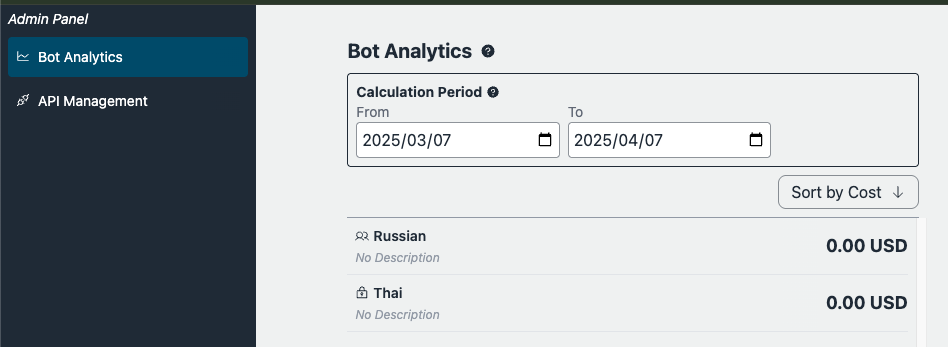

# Recursos administrativos

## Pré-requisitos

O usuário administrador deve ser um membro do grupo chamado `Admin`, que pode ser configurado através do console de gerenciamento > Amazon Cognito User pools ou aws cli. Note que o ID do grupo de usuários pode ser referenciado acessando CloudFormation > BedrockChatStack > Outputs > `AuthUserPoolIdxxxx`.


## Marcar bots públicos como Essenciais

Bots públicos agora podem ser marcados como "Essenciais" por administradores. Bots marcados como Essenciais serão destacados na seção "Essenciais" da loja de bots, tornando-os facilmente acessíveis aos usuários. Isso permite que os administradores destaquem bots importantes que desejam que todos os usuários utilizem.

### Exemplos

- Bot de Assistente de RH: Ajuda funcionários com perguntas e tarefas relacionadas a recursos humanos.
- Bot de Suporte de TI: Fornece assistência para problemas técnicos internos e gerenciamento de contas.
- Bot de Guia de Políticas Internas: Responde perguntas frequentes sobre regras de assiduidade, políticas de segurança e outros regulamentos internos.
- Bot de Integração de Novos Funcionários: Orienta novos funcionários sobre procedimentos e uso de sistemas em seu primeiro dia.
- Bot de Informações de Benefícios: Explica programas de benefícios corporativos e serviços de bem-estar.


## Loop de Feedback

A saída de um LLM nem sempre pode atender às expectativas do usuário. Às vezes, ele falha em satisfazer as necessidades do usuário. Para "integrar" efetivamente os LLMs nas operações comerciais e na vida cotidiana, implementar um loop de feedback é essencial. O Bedrock Chat é equipado com um recurso de feedback projetado para permitir que os usuários analisem por que surgiu a insatisfação. Com base nos resultados da análise, os usuários podem ajustar os prompts, fontes de dados RAG e parâmetros adequadamente.


Analistas de dados podem acessar logs de conversação usando [Amazon Athena](https://aws.amazon.com/jp/athena/). Se quiserem analisar os dados em um [Jupyter Notebook](https://jupyter.org/), [este exemplo de notebook](../examples/notebooks/feedback_analysis_example.ipynb) pode servir de referência.

## Painel

Atualmente fornece uma visão geral básica do uso do chatbot e do usuário, concentrando-se na agregação de dados para cada bot e usuário em períodos de tempo específicos e classificando os resultados por taxas de uso.



## Notas

- Como mencionado na [arquitetura](../README.md#architecture), os recursos de administração farão referência ao bucket S3 exportado do DynamoDB. Observe que, como a exportação é realizada a cada hora, as conversas mais recentes podem não ser refletidas imediatamente.

- Em usos públicos de bots, bots que não tenham sido usados durante o período especificado não serão listados.

- Em usos de usuários, usuários que não tenham usado o sistema durante o período especificado não serão listados.

> [!Importante]
> Se você estiver usando múltiplos ambientes (dev, prod, etc.), o nome do banco de dados Athena incluirá o prefixo do ambiente. Em vez de `bedrockchatstack_usage_analysis`, o nome do banco de dados será:
>
> - Para ambiente padrão: `bedrockchatstack_usage_analysis`
> - Para ambientes nomeados: `<prefixo-ambiente>_bedrockchatstack_usage_analysis` (por exemplo, `dev_bedrockchatstack_usage_analysis`)
>
> Além disso, o nome da tabela incluirá o prefixo do ambiente:
>
> - Para ambiente padrão: `ddb_export`
> - Para ambientes nomeados: `<prefixo-ambiente>_ddb_export` (por exemplo, `dev_ddb_export`)
>
> Certifique-se de ajustar suas consultas adequadamente ao trabalhar com múltiplos ambientes.

## Baixar dados de conversa

Você pode consultar os logs de conversação usando Athena, com SQL. Para baixar logs, abra o Editor de Consultas do Athena no console de gerenciamento e execute o SQL. A seguir, alguns exemplos de consultas úteis para analisar casos de uso. O feedback pode ser referenciado no atributo `MessageMap`.

### Consulta por ID do Bot

Edite `bot-id` e `datehour`. O `bot-id` pode ser encontrado na tela de Gerenciamento de Bot, acessível pelas APIs de Publicação de Bot, mostrado na barra lateral esquerda. Observe a parte final da URL como `https://xxxx.cloudfront.net/admin/bot/<bot-id>`.

```sql
SELECT
    d.newimage.PK.S AS UserId,
    d.newimage.SK.S AS ConversationId,
    d.newimage.MessageMap.S AS MessageMap,
    d.newimage.TotalPrice.N AS TotalPrice,
    d.newimage.CreateTime.N AS CreateTime,
    d.newimage.LastMessageId.S AS LastMessageId,
    d.newimage.BotId.S AS BotId,
    d.datehour AS DateHour
FROM
    bedrockchatstack_usage_analysis.ddb_export d
WHERE
    d.newimage.BotId.S = '<bot-id>'
    AND d.datehour BETWEEN '<yyyy/mm/dd/hh>' AND '<yyyy/mm/dd/hh>'
    AND d.Keys.SK.S LIKE CONCAT(d.Keys.PK.S, '#CONV#%')
ORDER BY
    d.datehour DESC;
```

> [!Nota]
> Se estiver usando um ambiente nomeado (por exemplo, "dev"), substitua `bedrockchatstack_usage_analysis.ddb_export` por `dev_bedrockchatstack_usage_analysis.dev_ddb_export` na consulta acima.

### Consulta por ID do Usuário

Edite `user-id` e `datehour`. O `user-id` pode ser encontrado na tela de Gerenciamento de Bot.

> [!Nota]
> Análises de uso do usuário estão em breve.

```sql
SELECT
    d.newimage.PK.S AS UserId,
    d.newimage.SK.S AS ConversationId,
    d.newimage.MessageMap.S AS MessageMap,
    d.newimage.TotalPrice.N AS TotalPrice,
    d.newimage.CreateTime.N AS CreateTime,
    d.newimage.LastMessageId.S AS LastMessageId,
    d.newimage.BotId.S AS BotId,
    d.datehour AS DateHour
FROM
    bedrockchatstack_usage_analysis.ddb_export d
WHERE
    d.newimage.PK.S = '<user-id>'
    AND d.datehour BETWEEN '<yyyy/mm/dd/hh>' AND '<yyyy/mm/dd/hh>'
    AND d.Keys.SK.S LIKE CONCAT(d.Keys.PK.S, '#CONV#%')
ORDER BY
    d.datehour DESC;
```

> [!Nota]
> Se estiver usando um ambiente nomeado (por exemplo, "dev"), substitua `bedrockchatstack_usage_analysis.ddb_export` por `dev_bedrockchatstack_usage_analysis.dev_ddb_export` na consulta acima.