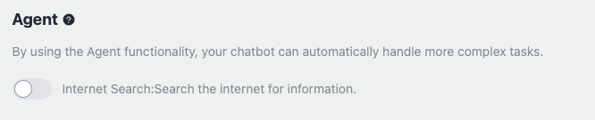
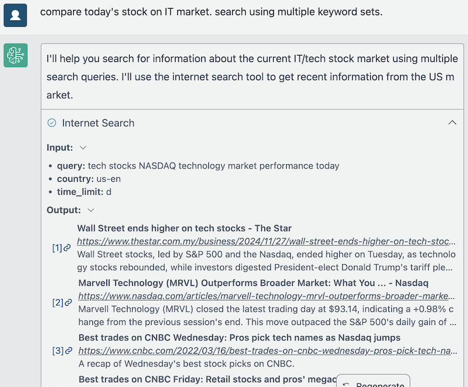
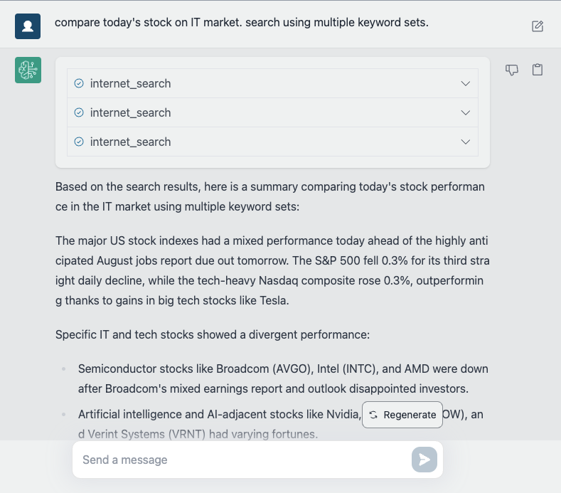
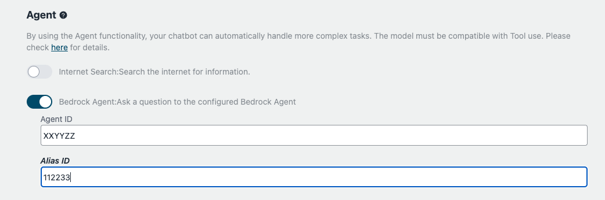

# LLM-gesteuerter Agent (ReAct)

## Was ist der Agent (ReAct)?

Ein Agent ist ein fortschrittliches KI-System, das große Sprachmodelle (Large Language Models, LLMs) als zentrales Berechnungsmodul verwendet. Er kombiniert die Reasoning-Fähigkeiten von LLMs mit zusätzlichen Funktionen wie Planung und Werkzeugnutzung, um komplexe Aufgaben autonom auszuführen. Agents können komplizierte Anfragen aufschlüsseln, schrittweise Lösungen generieren und mit externen Werkzeugen oder APIs interagieren, um Informationen zu sammeln oder Teilaufgaben auszuführen.

Diese Implementierung verwendet einen Agent mit dem [ReAct (Reasoning + Acting)](https://www.promptingguide.ai/techniques/react) Ansatz. ReAct ermöglicht es dem Agenten, komplexe Aufgaben zu lösen, indem Reasoning und Aktionen in einer iterativen Rückkopplungsschleife kombiniert werden. Der Agent durchläuft wiederholt drei Schlüsselschritte: Gedanke, Aktion und Beobachtung. Er analysiert die aktuelle Situation mithilfe des LLM, entscheidet über die nächste Aktion, führt die Aktion mit verfügbaren Werkzeugen oder APIs aus und lernt aus den beobachteten Ergebnissen. Dieser kontinuierliche Prozess ermöglicht es dem Agenten, sich an dynamische Umgebungen anzupassen, seine Aufgabenlösungsgenauigkeit zu verbessern und kontextbezogene Lösungen zu liefern.

## Beispielanwendungsfall

Ein Agent, der ReAct verwendet, kann in verschiedenen Szenarien eingesetzt werden und bietet präzise und effiziente Lösungen.

### Text-to-SQL

Ein Benutzer fragt nach "dem Gesamtumsatz des letzten Quartals". Der Agent interpretiert diese Anfrage, konvertiert sie in eine SQL-Abfrage, führt sie gegen die Datenbank aus und präsentiert die Ergebnisse.

### Finanzprognose

Ein Finanzanalyst muss den Umsatz für das nächste Quartal prognostizieren. Der Agent sammelt relevante Daten, führt notwendige Berechnungen mit Hilfe von Finanzmodellen durch und generiert einen detaillierten Prognosebericht, der die Genauigkeit der Projektionen sicherstellt.

## Die Agent-Funktion verwenden

Um die Agent-Funktionalität für Ihren angepassten Chatbot zu aktivieren, folgen Sie diesen Schritten:

Es gibt zwei Möglichkeiten, die Agent-Funktion zu nutzen:

### Tool-Nutzung

Um die Agent-Funktionalität mit Tool-Nutzung für Ihren angepassten Chatbot zu aktivieren, folgen Sie diesen Schritten:

1. Navigieren Sie zum Agent-Abschnitt im Bildschirm für benutzerdefinierte Bots.

2. Im Agent-Abschnitt finden Sie eine Liste der verfügbaren Tools, die vom Agent genutzt werden können. Standardmäßig sind alle Tools deaktiviert.

3. Um ein Tool zu aktivieren, schalten Sie einfach den Schalter neben dem gewünschten Tool um. Sobald ein Tool aktiviert ist, hat der Agent Zugriff darauf und kann es bei der Verarbeitung von Benutzeranfragen nutzen.

4. Das Tool "Internet-Suche" ermöglicht es dem Agenten beispielsweise, Informationen aus dem Internet zu suchen, um Benutzerfragen zu beantworten.

5. Sie können eigene benutzerdefinierte Tools entwickeln, um die Fähigkeiten des Agenten zu erweitern. Weitere Informationen zur Erstellung und Integration benutzerdefinierter Tools finden Sie im Abschnitt [Eigene Tools entwickeln](#how-to-develop-your-own-tools).

### Bedrock Agent verwenden

Sie können einen in Amazon Bedrock erstellten [Bedrock Agent](https://aws.amazon.com/bedrock/agents/) nutzen.

Erstellen Sie zunächst einen Agenten in Bedrock (z.B. über die Verwaltungskonsole). Geben Sie dann die Agent-ID in den Einstellungen des benutzerdefinierten Bots an. Sobald dies erfolgt ist, wird Ihr Chatbot den Bedrock-Agenten zur Verarbeitung von Benutzeranfragen nutzen.

## Wie Sie Ihre eigenen Tools entwickeln

Um Ihre eigenen benutzerdefinierten Tools für den Agenten zu entwickeln, folgen Sie diesen Richtlinien:

- Erstellen Sie eine neue Klasse, die von der `AgentTool`-Klasse erbt. Obwohl die Schnittstelle mit LangChain kompatibel ist, stellt diese Beispielimplementierung ihre eigene `AgentTool`-Klasse bereit, von der Sie erben sollten ([Quelle](../backend/app/agents/tools/agent_tool.py)).

- Beziehen Sie sich auf die Beispielimplementierung eines [BMI-Berechnungstools](../examples/agents/tools/bmi/bmi.py). Dieses Beispiel zeigt, wie Sie ein Tool erstellen, das den Body-Mass-Index (BMI) basierend auf Benutzereingaben berechnet.

  - Der Name und die Beschreibung, die für das Tool deklariert werden, werden verwendet, wenn der LLM entscheidet, welches Tool zur Beantwortung der Benutzerfrage verwendet werden soll. Mit anderen Worten, sie werden in die Eingabeaufforderung eingebettet, wenn der LLM aufgerufen wird. Daher wird empfohlen, sie so präzise wie möglich zu beschreiben.

- [Optional] Sobald Sie Ihr benutzerdefiniertes Tool implementiert haben, wird empfohlen, seine Funktionalität mithilfe eines Testskripts ([Beispiel](../examples/agents/tools/bmi/test_bmi.py)) zu überprüfen. Dieses Skript hilft Ihnen sicherzustellen, dass Ihr Tool wie erwartet funktioniert.

- Nachdem Sie die Entwicklung und das Testen Ihres benutzerdefinierten Tools abgeschlossen haben, verschieben Sie die Implementierungsdatei in das Verzeichnis [backend/app/agents/tools/](../backend/app/agents/tools/). Öffnen Sie dann [backend/app/agents/utils.py](../backend/app/agents/utils.py) und bearbeiten Sie `get_available_tools`, damit der Benutzer das entwickelte Tool auswählen kann.

- [Optional] Fügen Sie klare Namen und Beschreibungen für das Frontend hinzu. Dieser Schritt ist optional, aber wenn Sie ihn nicht ausführen, werden der Toolname und die Beschreibung verwendet, die in Ihrem Tool deklariert sind. Diese sind für den LLM gedacht, aber nicht für den Benutzer, daher wird empfohlen, eine dedizierte Erklärung für eine bessere Benutzererfahrung hinzuzufügen.

  - Bearbeiten Sie i18n-Dateien. Öffnen Sie [en/index.ts](../frontend/src/i18n/en/index.ts) und fügen Sie Ihren eigenen `name` und `description` zu `agent.tools` hinzu.
  - Bearbeiten Sie auch `xx/index.ts`. Dabei steht `xx` für den Ländercode, den Sie wünschen.

- Führen Sie `npx cdk deploy` aus, um Ihre Änderungen zu implementieren. Dies macht Ihr benutzerdefiniertes Tool im benutzerdefinierten Bot-Bildschirm verfügbar.

## Beitrag

**Beiträge zum Tool-Repository sind willkommen!** Wenn Sie ein nützliches und gut implementiertes Tool entwickeln, erwägen Sie, es dem Projekt beizusteuern, indem Sie ein Issue oder einen Pull Request einreichen.