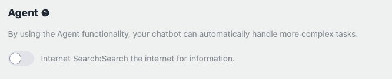
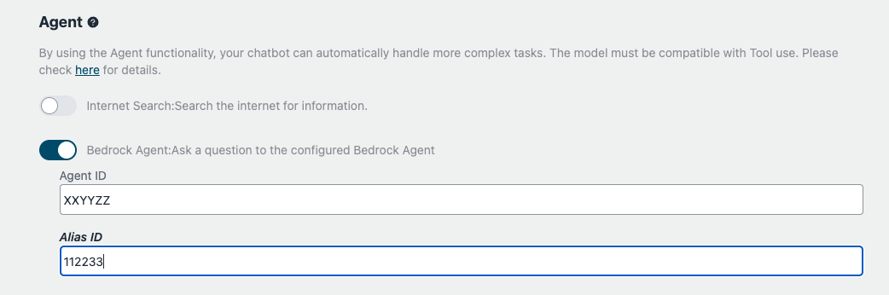

# Agente Alimentado por LLM (ReAct)

## O que é o Agente (ReAct)?

Um Agente é um sistema de IA avançado que utiliza modelos de linguagem de grande escala (LLMs) como seu motor computacional central. Ele combina as capacidades de raciocínio dos LLMs com funcionalidades adicionais como planejamento e uso de ferramentas para realizar tarefas complexas de forma autônoma. Agentes podem decompor consultas complicadas, gerar soluções passo a passo e interagir com ferramentas externas ou APIs para coletar informações ou executar subtarefas.

Esta amostra implementa um Agente usando a abordagem [ReAct (Reasoning + Acting)](https://www.promptingguide.ai/techniques/react). O ReAct permite que o agente resolva tarefas complexas combinando raciocínio e ações em um loop de feedback iterativo. O agente passa repetidamente por três etapas principais: Pensamento, Ação e Observação. Ele analisa a situação atual usando o LLM, decide sobre a próxima ação a ser tomada, executa a ação usando ferramentas ou APIs disponíveis e aprende com os resultados observados. Esse processo contínuo permite que o agente se adapte a ambientes dinâmicos, melhore sua precisão na resolução de tarefas e forneça soluções com consciência de contexto.

## Caso de Uso de Exemplo

Um Agente usando ReAct pode ser aplicado em diversos cenários, fornecendo soluções precisas e eficientes.

### Texto para SQL

Um usuário solicita "o total de vendas do último trimestre". O Agente interpreta essa solicitação, converte-a em uma consulta SQL, executa-a no banco de dados e apresenta os resultados.

### Previsão Financeira

Um analista financeiro precisa prever a receita do próximo trimestre. O Agente coleta dados relevantes, realiza cálculos necessários usando modelos financeiros e gera um relatório de previsão detalhado, garantindo a precisão das projeções.

## Como usar o Recurso de Agente

Para habilitar a funcionalidade de Agente no seu chatbot personalizado, siga estas etapas:

Existem duas maneiras de usar o recurso de Agente:

### Usando Uso de Ferramenta

Para habilitar a funcionalidade de Agente com Uso de Ferramenta para o seu chatbot personalizado, siga estas etapas:

1. Navegue até a seção de Agente na tela do bot personalizado.

2. Na seção de Agente, você encontrará uma lista de ferramentas disponíveis que podem ser usadas pelo Agente. Por padrão, todas as ferramentas estão desativadas.

3. Para ativar uma ferramenta, basta alternar o botão ao lado da ferramenta desejada. Uma vez que uma ferramenta é habilitada, o Agente terá acesso a ela e poderá utilizá-la ao processar consultas do usuário.

4. Por exemplo, a ferramenta "Pesquisa na Internet" permite que o Agente busque informações na internet para responder a perguntas do usuário.

5. Você pode desenvolver e adicionar suas próprias ferramentas personalizadas para estender as capacidades do Agente. Consulte a seção [Como desenvolver suas próprias ferramentas](#how-to-develop-your-own-tools) para obter mais informações sobre a criação e integração de ferramentas personalizadas.

### Usando Agente Bedrock

Você pode utilizar um [Agente Bedrock](https://aws.amazon.com/bedrock/agents/) criado no Amazon Bedrock.

Primeiro, crie um Agente no Bedrock (por exemplo, através do Console de Gerenciamento). Em seguida, especifique o ID do Agente nas configurações do bot personalizado. Uma vez definido, seu chatbot utilizará o Agente Bedrock para processar consultas do usuário.

## Como desenvolver suas próprias ferramentas

Para desenvolver ferramentas personalizadas para o Agente, siga estas diretrizes:

- Crie uma nova classe que herda da classe `AgentTool`. Embora a interface seja compatível com LangChain, esta implementação de exemplo fornece sua própria classe `AgentTool`, da qual você deve herdar ([source](../backend/app/agents/tools/agent_tool.py)).

- Consulte a implementação de exemplo de uma [ferramenta de cálculo de IMC](../examples/agents/tools/bmi/bmi.py). Este exemplo demonstra como criar uma ferramenta que calcula o Índice de Massa Corporal (IMC) com base na entrada do usuário.

  - O nome e a descrição declarados na ferramenta são usados quando o LLM considera qual ferramenta deve ser usada para responder à pergunta do usuário. Em outras palavras, eles são incorporados no prompt quando o LLM é invocado. Portanto, é recomendado descrever com a maior precisão possível.

- [Opcional] Depois de implementar sua ferramenta personalizada, é recomendado verificar sua funcionalidade usando um script de teste ([exemplo](../examples/agents/tools/bmi/test_bmi.py)). Este script ajudará você a garantir que sua ferramenta esteja funcionando como esperado.

- Após concluir o desenvolvimento e teste da sua ferramenta personalizada, mova o arquivo de implementação para o diretório [backend/app/agents/tools/](../backend/app/agents/tools/). Em seguida, abra [backend/app/agents/utils.py](../backend/app/agents/utils.py) e edite `get_available_tools` para que o usuário possa selecionar a ferramenta desenvolvida.

- [Opcional] Adicione nomes e descrições claras para o frontend. Esta etapa é opcional, mas se você não a fizer, o nome e a descrição da ferramenta declarados em sua ferramenta serão usados. Eles são para o LLM, mas não para o usuário, portanto, é recomendado adicionar uma explicação dedicada para melhorar a experiência do usuário.

  - Edite os arquivos i18n. Abra [en/index.ts](../frontend/src/i18n/en/index.ts) e adicione seu próprio `name` e `description` em `agent.tools`.
  - Edite também `xx/index.ts`. Onde `xx` representa o código do país que você deseja.

- Execute `npx cdk deploy` para implantar suas alterações. Isso tornará sua ferramenta personalizada disponível na tela de bot personalizado.

## Contribuição

**Contribuições para o repositório da ferramenta são bem-vindas!** Se você desenvolver uma ferramenta útil e bem implementada, considere contribuir com o projeto enviando um issue ou um pull request.