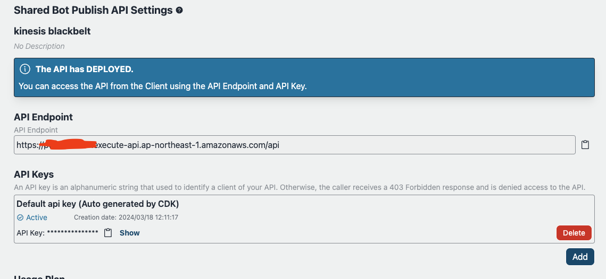

# API-Veröffentlichung

## Überblick

Dieses Beispiel umfasst eine Funktion zum Veröffentlichen von APIs. Obwohl eine Chat-Schnittstelle für eine vorläufige Validierung bequem sein kann, hängt die tatsächliche Implementierung vom spezifischen Anwendungsfall und der gewünschten Benutzererfahrung (UX) ab. In manchen Szenarien kann eine Chat-Benutzeroberfläche die bevorzugte Wahl sein, während in anderen eine eigenständige API besser geeignet ist. Nach der ersten Validierung bietet dieses Beispiel die Möglichkeit, angepasste Bots gemäß den Projektanforderungen zu veröffentlichen. Durch die Eingabe von Einstellungen für Kontingente, Drosselung, Ursprünge usw. kann ein Endpunkt zusammen mit einem API-Schlüssel veröffentlicht werden, was Flexibilität für verschiedene Integrationsoptionen bietet.

## Sicherheit

Die Verwendung eines API-Schlüssels allein wird nicht empfohlen, wie im [AWS API Gateway Entwicklerhandbuch](https://docs.aws.amazon.com/apigateway/latest/developerguide/api-gateway-api-usage-plans.html) beschrieben. Infolgedessen implementiert dieses Beispiel eine einfache IP-Adresseinschränkung über AWS WAF. Die WAF-Regel wird aufgrund von Kostenerwägungen einheitlich über die Anwendung hinweg angewendet, unter der Annahme, dass die Quellen, die man einschränken möchte, wahrscheinlich für alle ausgegebenen APIs gleich sind. **Bitte halten Sie sich bei der tatsächlichen Implementierung an die Sicherheitsrichtlinien Ihrer Organisation.** Weitere Informationen finden Sie auch im Abschnitt [Architektur](#architektur).

## Wie man einen benutzerdefinierten Bot-API veröffentlicht

### Voraussetzungen

Aus Governance-Gründen können nur begrenzte Benutzer Bots veröffentlichen. Vor der Veröffentlichung muss der Benutzer Mitglied der Gruppe `PublishAllowed` sein, die über die Verwaltungskonsole > Amazon Cognito User Pools oder AWS CLI eingerichtet werden kann. Beachten Sie, dass die Benutzer-Pool-ID durch Zugriff auf CloudFormation > BedrockChatStack > Outputs > `AuthUserPoolIdxxxx` referenziert werden kann.

### API-Veröffentlichungseinstellungen

Nach der Anmeldung als `PublishedAllowed`-Benutzer und der Erstellung eines Bots wählen Sie `API-Veröffentlichungseinstellungen`. Beachten Sie, dass nur ein freigegebener Bot veröffentlicht werden kann.

Auf dem folgenden Bildschirm können mehrere Parameter bezüglich des Throttlings konfiguriert werden. Weitere Informationen finden Sie unter: [API-Anfragen für besseren Durchsatz begrenzen](https://docs.aws.amazon.com/apigateway/latest/developerguide/api-gateway-request-throttling.html).

Nach der Bereitstellung erscheint der folgende Bildschirm, auf dem Sie die Endpunkt-URL und einen API-Schlüssel abrufen können. Es können auch API-Schlüssel hinzugefügt und gelöscht werden.

## Architektur

Die API wird wie folgt veröffentlicht:

Die WAF wird für IP-Adresseinschränkungen verwendet. Die Adresse kann durch Festlegen der Parameter `publishedApiAllowedIpV4AddressRanges` und `publishedApiAllowedIpV6AddressRanges` in `cdk.json` konfiguriert werden.

Sobald ein Benutzer den Bot veröffentlicht, startet [AWS CodeBuild](https://aws.amazon.com/codebuild/) eine CDK-Bereitstellungsaufgabe zur Bereitstellung des API-Stacks (Siehe auch: [CDK-Definition](../cdk/lib/api-publishment-stack.ts)), der API Gateway, Lambda und SQS enthält. SQS wird verwendet, um Benutzeranfragen und LLM-Operationen zu entkoppeln, da die Ausgabegenerierung 30 Sekunden überschreiten kann, was dem Grenzwert des API Gateway-Kontingents entspricht. Um die Ausgabe abzurufen, muss auf die API asynchron zugegriffen werden. Weitere Details finden Sie in der [API-Spezifikation](#api-specification).

Der Client muss `x-api-key` im Anforderungsheader setzen.

## API-Spezifikation

Sehen Sie [hier](https://aws-samples.github.io/bedrock-chat).