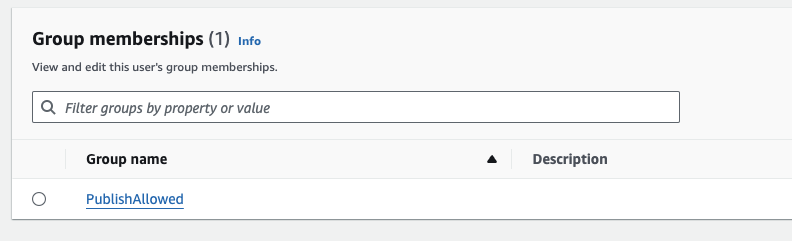

# Publication d'API

## Vue d'ensemble

Cet exemple inclut une fonctionnalité de publication d'API. Bien qu'une interface de chat puisse être pratique pour une validation préliminaire, l'implémentation réelle dépend du cas d'utilisation spécifique et de l'expérience utilisateur (UX) souhaitée pour l'utilisateur final. Dans certains scénarios, une interface de chat peut être le choix privilégié, tandis que dans d'autres, une API autonome peut être plus appropriée. Après une validation initiale, cet exemple offre la possibilité de publier des bots personnalisés selon les besoins du projet. En saisissant des paramètres tels que les quotas, la limitation du débit, les origines, etc., un point de terminaison peut être publié avec une clé API, offrant ainsi une flexibilité pour différentes options d'intégration.

## Sécurité

L'utilisation d'une clé API seule n'est pas recommandée comme décrit dans : [Guide du développeur AWS API Gateway](https://docs.aws.amazon.com/apigateway/latest/developerguide/api-gateway-api-usage-plans.html). Par conséquent, cet exemple met en œuvre une restriction simple d'adresse IP via AWS WAF. La règle WAF est appliquée communément à l'ensemble de l'application en raison de considérations de coût, en partant du principe que les sources que l'on souhaiterait restreindre sont probablement les mêmes pour tous les API émis. **Veuillez vous conformer à la politique de sécurité de votre organisation pour l'implémentation réelle.** Voir également la section [Architecture](#architecture).

## Comment publier une API de bot personnalisée

### Prérequis

Pour des raisons de gouvernance, seuls certains utilisateurs peuvent publier des bots. Avant la publication, l'utilisateur doit être membre du groupe appelé `PublishAllowed`, qui peut être configuré via la console de gestion > Amazon Cognito User pools ou l'interface CLI AWS. Notez que l'ID du groupe d'utilisateurs peut être consulté en accédant à CloudFormation > BedrockChatStack > Outputs > `AuthUserPoolIdxxxx`.

### Paramètres de publication d'API

Après s'être connecté en tant qu'utilisateur `PublishedAllowed` et avoir créé un bot, choisissez `API PublishSettings`. Notez qu'un bot partagé peut uniquement être publié.

Sur l'écran suivant, vous pouvez configurer plusieurs paramètres concernant la limitation du débit. Pour plus de détails, consultez également : [Limiter les requêtes d'API pour un meilleur débit](https://docs.aws.amazon.com/apigateway/latest/developerguide/api-gateway-request-throttling.html).

Après le déploiement, l'écran suivant apparaîtra, où vous pourrez obtenir l'URL du point de terminaison et une clé API. Vous pouvez également ajouter et supprimer des clés API.

## Architecture

L'API est publiée selon le diagramme suivant :

Le WAF est utilisé pour la restriction des adresses IP. Les adresses peuvent être configurées en définissant les paramètres `publishedApiAllowedIpV4AddressRanges` et `publishedApiAllowedIpV6AddressRanges` dans `cdk.json`.

Une fois qu'un utilisateur clique sur publier le bot, [AWS CodeBuild](https://aws.amazon.com/codebuild/) lance une tâche de déploiement CDK pour provisionner la pile API (Voir également : [Définition CDK](../cdk/lib/api-publishment-stack.ts)) qui contient API Gateway, Lambda et SQS. SQS est utilisé pour découpler la requête utilisateur et l'opération LLM car la génération de la sortie peut dépasser 30 secondes, qui est la limite du quota d'API Gateway. Pour récupérer la sortie, il est nécessaire d'accéder à l'API de manière asynchrone. Pour plus de détails, voir [Spécification de l'API](#api-specification).

Le client doit définir `x-api-key` dans l'en-tête de la requête.

## Spécification de l'API

Voir [ici](https://aws-samples.github.io/bedrock-chat).