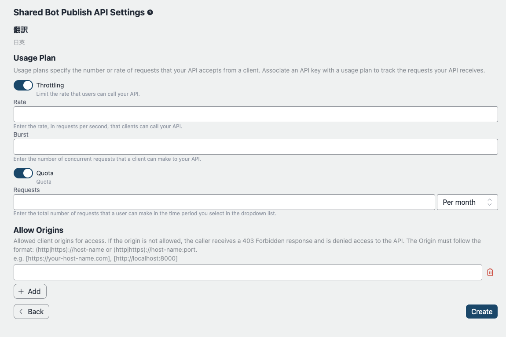
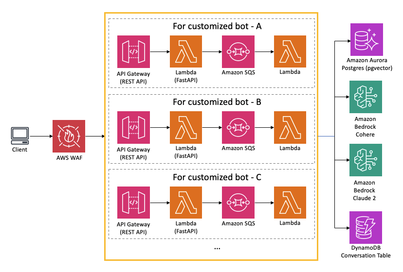

# Publikacja API

## Przegląd

Ten przykład obejmuje funkcję publikowania interfejsów API. Chociaż interfejs czatu może być wygodny do wstępnej weryfikacji, rzeczywista implementacja zależy od konkretnego przypadku użycia i pożądanego doświadczenia użytkownika (UX). W niektórych scenariuszach interfejs czatu może być preferowanym wyborem, podczas gdy w innych bardziej odpowiedni może być samodzielny interfejs API. Po wstępnej weryfikacji, ten przykład zapewnia możliwość publikowania dostosowanych botów zgodnie z potrzebami projektu. Wprowadzając ustawienia dotyczące limitów, ograniczania przepustowości, źródeł itp., można opublikować endpoint wraz z kluczem API, oferując elastyczność dla różnych opcji integracji.

## Bezpieczeństwo

Użycie wyłącznie klucza API nie jest zalecane, co opisano w: [AWS API Gateway Developer Guide](https://docs.aws.amazon.com/apigateway/latest/developerguide/api-gateway-api-usage-plans.html). W konsekwencji, ten przykład implementuje prostą restrickcję adresu IP za pomocą AWS WAF. Reguła WAF jest stosowana wspólnie dla całej aplikacji ze względów kosztowych, zakładając, że źródła, które chciałoby się ograniczyć, są prawdopodobnie takie same we wszystkich udostępnionych interfejsach API. **Prosimy o stosowanie się do polityki bezpieczeństwa organizacji podczas rzeczywistej implementacji.** Zapoznaj się również z sekcją [Architektura](#architektura).

## Jak opublikować niestandardowe API bota

### Wymagania wstępne

Ze względów zarządzania, tylko ograniczona liczba użytkowników może publikować boty. Przed publikacją użytkownik musi być członkiem grupy o nazwie `PublishAllowed`, którą można skonfigurować za pośrednictwem konsoli zarządzania > Amazon Cognito User pools lub aws cli. Należy pamiętać, że identyfikator puli użytkowników można znaleźć, uzyskując dostęp do CloudFormation > BedrockChatStack > Outputs > `AuthUserPoolIdxxxx`.

### Ustawienia publikacji API

Po zalogowaniu się jako użytkownik `PublishedAllowed` i utworzeniu bota, wybierz `API PublishSettings`. Należy pamiętać, że opublikować można tylko współdzielonego bota.

Na następnym ekranie można skonfigurować kilka parametrów dotyczących ograniczania przepustowości. Więcej szczegółów można znaleźć w: [Ograniczanie żądań API dla lepszej przepustowości](https://docs.aws.amazon.com/apigateway/latest/developerguide/api-gateway-request-throttling.html).

Po wdrożeniu pojawi się następny ekran, na którym można uzyskać adres URL punktu końcowego i klucz API. Można również dodawać i usuwać klucze API.

## Architektura

Interfejs API jest publikowany zgodnie z poniższym diagramem:

WAF jest używany do ograniczenia adresów IP. Adresy można skonfigurować, ustawiając parametry `publishedApiAllowedIpV4AddressRanges` i `publishedApiAllowedIpV6AddressRanges` w pliku `cdk.json`.

Gdy użytkownik kliknie publikację bota, [AWS CodeBuild](https://aws.amazon.com/codebuild/) uruchamia zadanie wdrożenia CDK w celu udostępnienia stosu API (patrz również: [Definicja CDK](../cdk/lib/api-publishment-stack.ts)), który zawiera API Gateway, Lambda i SQS. SQS służy do rozdzielenia żądania użytkownika i operacji LLM, ponieważ generowanie wyniku może przekroczyć 30 sekund, co jest limitem API Gateway. Aby pobrać wynik, należy uzyskać dostęp do API asynchronicznie. Więcej szczegółów można znaleźć w [Specyfikacji API](#api-specification).

Klient musi ustawić `x-api-key` w nagłówku żądania.

## Specyfikacja API

Zobacz [tutaj](https://aws-samples.github.io/bedrock-chat).