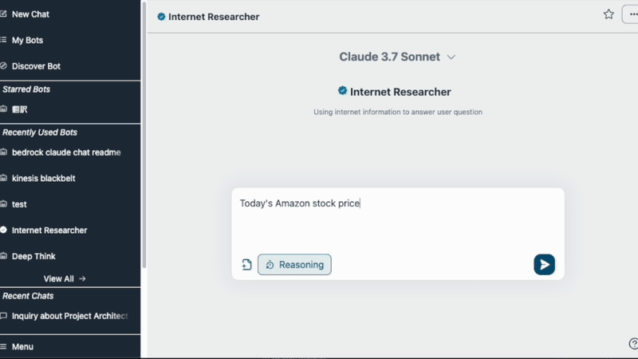
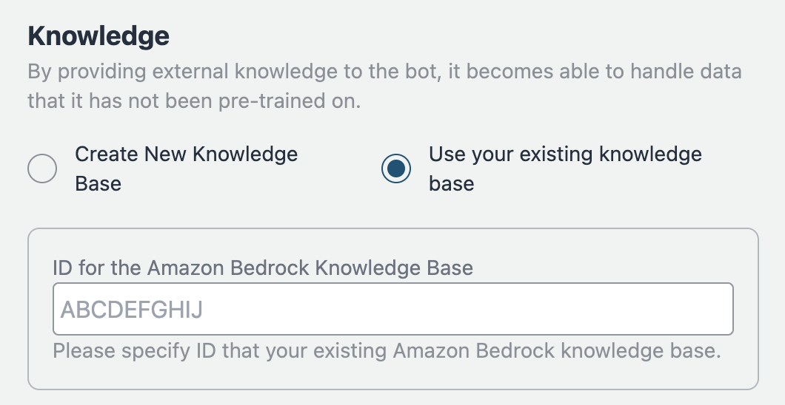
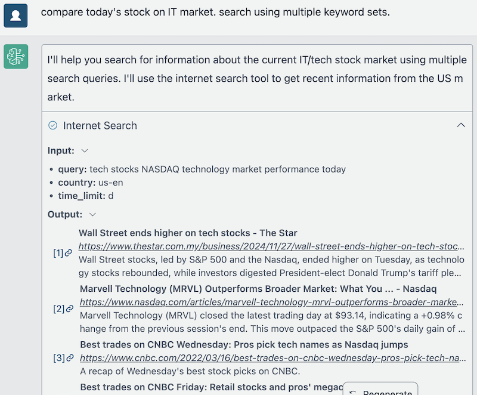

<h1 align="center">Bedrock Chat (BrChat)</h1>

<p align="center">
  
  
  
  <a href="https://github.com/aws-samples/bedrock-chat/issues?q=is%3Aissue%20state%3Aopen%20label%3Aroadmap">
    
  </a>
</p>

[English](https://github.com/aws-samples/bedrock-chat/blob/v3/README.md) | [日本語](https://github.com/aws-samples/bedrock-chat/blob/v3/docs/README_ja-JP.md) | [한국어](https://github.com/aws-samples/bedrock-chat/blob/v3/docs/README_ko-KR.md) | [中文](https://github.com/aws-samples/bedrock-chat/blob/v3/docs/README_zh-CN.md) | [Français](https://github.com/aws-samples/bedrock-chat/blob/v3/docs/README_fr-FR.md) | [Deutsch](https://github.com/aws-samples/bedrock-chat/blob/v3/docs/README_de-DE.md) | [Español](https://github.com/aws-samples/bedrock-chat/blob/v3/docs/README_es-ES.md) | [Italian](https://github.com/aws-samples/bedrock-chat/blob/v3/docs/README_it-IT.md) | [Norsk](https://github.com/aws-samples/bedrock-chat/blob/v3/docs/README_nb-NO.md) | [ไทย](https://github.com/aws-samples/bedrock-chat/blob/v3/docs/README_th-TH.md) | [Bahasa Indonesia](https://github.com/aws-samples/bedrock-chat/blob/v3/docs/README_id-ID.md) | [Bahasa Melayu](https://github.com/aws-samples/bedrock-chat/blob/v3/docs/README_ms-MY.md) | [Tiếng Việt](https://github.com/aws-samples/bedrock-chat/blob/v3/docs/README_vi-VN.md) | [Polski](https://github.com/aws-samples/bedrock-chat/blob/v3/docs/README_pl-PL.md) | [Português Brasil](https://github.com/aws-samples/bedrock-chat/blob/v3/docs/README_pt-BR.md)

Wielojęzyczna platforma generatywnej sztucznej inteligencji napędzana przez [Amazon Bedrock](https://aws.amazon.com/bedrock/).
Obsługuje czat, niestandardowe boty z wiedzą (RAG), udostępnianie botów za pośrednictwem sklepu z botami oraz automatyzację zadań przy użyciu agentów.



> [!Warning]
>
> **Wydano wersję V3. Aby zaktualizować, prosimy dokładnie zapoznać się z [przewodnikiem migracji](./migration/V2_TO_V3_pl-PL.md).** Bez zachowania ostrożności **BOTY Z WERSJI V2 STANĄ SIĘ BEZUŻYTECZNE.**

### Personalizacja botów / Sklep z botami

Dodaj własne instrukcje i wiedzę (tzw. [RAG](https://aws.amazon.com/what-is/retrieval-augmented-generation/)). Bot może być udostępniany użytkownikom aplikacji za pośrednictwem sklepu z botami. Dostosowany bot może być również opublikowany jako samodzielne API (patrz [szczegóły](./PUBLISH_API_pl-PL.md)).

<details>
<summary>Zrzuty ekranu</summary>


Możesz również importować istniejące [Bazy wiedzy Amazon Bedrock](https://aws.amazon.com/bedrock/knowledge-bases/).



</details>

> [!Important]
> Ze względów zarządzania, tylko uprawnieni użytkownicy mogą tworzyć niestandardowe boty. Aby umożliwić tworzenie niestandardowych botów, użytkownik musi być członkiem grupy o nazwie `CreatingBotAllowed`, którą można skonfigurować za pośrednictwem konsoli zarządzania > Pule użytkowników Amazon Cognito lub interfejsu wiersza poleceń AWS. Należy pamiętać, że identyfikator puli użytkowników można znaleźć, uzyskując dostęp do CloudFormation > BedrockChatStack > Outputs > `AuthUserPoolIdxxxx`.

### Funkcje administracyjne

Zarządzanie interfejsem API, oznaczanie botów jako kluczowych, analiza użycia botów. [szczegóły](./ADMINISTRATOR_pl-PL.md)

<details>
<summary>Zrzuty ekranu</summary>


)

</details>

### Agent

Korzystając z [funkcjonalności Agenta](./AGENT_pl-PL.md), Twój chatbot może automatycznie obsługiwać bardziej złożone zadania. Na przykład, aby odpowiedzieć na pytanie użytkownika, Agent może pobrać niezbędne informacje z narzędzi zewnętrznych lub podzielić zadanie na wiele kroków do przetworzenia.

<details>
<summary>Zrzuty ekranu</summary>




</details>

## 🚀 Super-łatwe Wdrożenie

- W regionie us-east-1, otwórz [Dostęp do modelu Bedrock](https://us-east-1.console.aws.amazon.com/bedrock/home?region=us-east-1#/modelaccess) > `Zarządzaj dostępem do modeli` > Zaznacz wszystkie modele, które chcesz używać, a następnie `Zapisz zmiany`.

<details>
<summary>Zrzut ekranu</summary>


</details>

- Otwórz [CloudShell](https://console.aws.amazon.com/cloudshell/home) w regionie, w którym chcesz wdrożyć
- Uruchom wdrożenie za pomocą następujących poleceń. Jeśli chcesz określić wersję do wdrożenia lub potrzebujesz zastosować zasady bezpieczeństwa, określ odpowiednie parametry z [Parametrów opcjonalnych](#opcjonalne-parametry).

```sh
git clone https://github.com/aws-samples/bedrock-chat.git
cd bedrock-chat
chmod +x bin.sh
./bin.sh
```

- Zostaniesz zapytany, czy jesteś nowym użytkownikiem czy używasz wersji 3. Jeśli nie jesteś kontynuującym użytkownikiem z wersji 0, wprowadź `y`.

### Parametry opcjonalne

Podczas wdrożenia możesz określić następujące parametry, aby zwiększyć bezpieczeństwo i dostosować konfigurację:

- **--disable-self-register**: Wyłącz samodzielną rejestrację (domyślnie: włączone). Jeśli ta flaga jest ustawiona, będziesz musiał utworzyć wszystkich użytkowników w Cognito i nie pozwoli na samodzielną rejestrację kont.
- **--enable-lambda-snapstart**: Włącz [Lambda SnapStart](https://docs.aws.amazon.com/lambda/latest/dg/snapstart.html) (domyślnie: wyłączone). Jeśli ta flaga jest ustawiona, poprawia czasy zimnego startu dla funkcji Lambda, zapewniając szybsze czasy odpowiedzi dla lepszego doświadczenia użytkownika.
- **--ipv4-ranges**: Rozdzielona przecinkami lista dozwolonych zakresów IPv4. (domyślnie: zezwalaj na wszystkie adresy IPv4)
- **--ipv6-ranges**: Rozdzielona przecinkami lista dozwolonych zakresów IPv6. (domyślnie: zezwalaj na wszystkie adresy IPv6)
- **--disable-ipv6**: Wyłącz połączenia przez IPv6. (domyślnie: włączone)
- **--allowed-signup-email-domains**: Rozdzielona przecinkami lista dozwolonych domen poczty elektronicznej do rejestracji. (domyślnie: brak ograniczeń domen)
- **--bedrock-region**: Zdefiniuj region, w którym dostępny jest Bedrock. (domyślnie: us-east-1)
- **--repo-url**: Niestandardowe repozytorium Bedrock Chat do wdrożenia, jeśli jest rozwidlone lub używane niestandardowe źródło kontroli. (domyślnie: https://github.com/aws-samples/bedrock-chat.git)
- **--version**: Wersja Bedrock Chat do wdrożenia. (domyślnie: najnowsza wersja w rozwoju)
- **--cdk-json-override**: Możesz zastąpić dowolne wartości kontekstu CDK podczas wdrożenia, używając bloku zastąpienia JSON. Pozwala to modyfikować konfigurację bez bezpośredniej edycji pliku cdk.json.

Przykład użycia:

```bash
./bin.sh --cdk-json-override '{
  "context": {
    "selfSignUpEnabled": false,
    "enableLambdaSnapStart": true,
    "allowedIpV4AddressRanges": ["192.168.1.0/24"],
    "allowedSignUpEmailDomains": ["example.com"]
  }
}'
```

Zastępujący JSON musi mieć tę samą strukturę co cdk.json. Możesz zastąpić dowolne wartości kontekstu, w tym:

- `selfSignUpEnabled`
- `enableLambdaSnapStart`
- `allowedIpV4AddressRanges`
- `allowedIpV6AddressRanges`
- `allowedSignUpEmailDomains`
- `bedrockRegion`
- `enableRagReplicas`
- `enableBedrockCrossRegionInference`
- I inne wartości kontekstu zdefiniowane w cdk.json

> [!Uwaga]
> Wartości zastąpienia zostaną scalane z istniejącą konfiguracją cdk.json podczas wdrożenia w AWS code build. Wartości określone w zastąpieniu będą miały pierwszeństwo przed wartościami w cdk.json.

#### Przykładowe polecenie z parametrami:

```sh
./bin.sh --disable-self-register --ipv4-ranges "192.0.2.0/25,192.0.2.128/25" --ipv6-ranges "2001:db8:1:2::/64,2001:db8:1:3::/64" --allowed-signup-email-domains "example.com,anotherexample.com" --bedrock-region "us-west-2" --version "v1.2.6"
```

- Po około 35 minutach otrzymasz następujące dane wyjściowe, do których możesz uzyskać dostęp z poziomu przeglądarki

```
Frontend URL: https://xxxxxxxxx.cloudfront.net
```


Pojawi się ekran rejestracji jak pokazano powyżej, gdzie możesz zarejestrować swój adres e-mail i się zalogować.

> [!Ważne]
> Bez ustawienia parametru opcjonalnego, ta metoda wdrożenia pozwala każdemu, kto zna adres URL, na rejestrację. W przypadku użycia produkcyjnego zdecydowanie zaleca się dodanie ograniczeń adresów IP i wyłączenie samodzielnej rejestracji, aby ograniczyć ryzyko bezpieczeństwa (możesz zdefiniować allowed-signup-email-domains, aby ograniczyć użytkowników tylko do adresów e-mail z domeny Twojej firmy). Użyj zarówno ipv4-ranges, jak i ipv6-ranges do ograniczenia adresów IP oraz wyłącz samodzielną rejestrację, używając disable-self-register podczas wykonywania ./bin.

> [!WSKAZÓWKA]
> Jeśli `Frontend URL` nie pojawia się lub Bedrock Chat nie działa prawidłowo, może to być problem z najnowszą wersją. W takim przypadku dodaj `--version "v3.0.0"` do parametrów i spróbuj wdrożenia ponownie.

## Architektura

Jest to architektura zbudowana w oparciu o zarządzane usługi AWS, eliminująca potrzebę zarządzania infrastrukturą. Wykorzystując Amazon Bedrock, nie ma potrzeby komunikacji z interfejsami API spoza AWS. Umożliwia to wdrażanie skalowalnych, niezawodnych i bezpiecznych aplikacji.

- [Amazon DynamoDB](https://aws.amazon.com/dynamodb/): Baza danych NoSQL do przechowywania historii rozmów
- [Amazon API Gateway](https://aws.amazon.com/api-gateway/) + [AWS Lambda](https://aws.amazon.com/lambda/): Endpoint API zaplecza ([AWS Lambda Web Adapter](https://github.com/awslabs/aws-lambda-web-adapter), [FastAPI](https://fastapi.tiangolo.com/))
- [Amazon CloudFront](https://aws.amazon.com/cloudfront/) + [S3](https://aws.amazon.com/s3/): Dostarczanie aplikacji frontendowej ([React](https://react.dev/), [Tailwind CSS](https://tailwindcss.com/))
- [AWS WAF](https://aws.amazon.com/waf/): Ograniczanie adresów IP
- [Amazon Cognito](https://aws.amazon.com/cognito/): Uwierzytelnianie użytkowników
- [Amazon Bedrock](https://aws.amazon.com/bedrock/): Usługa zarządzana do wykorzystania modeli bazowych za pośrednictwem interfejsów API
- [Amazon Bedrock Knowledge Bases](https://aws.amazon.com/bedrock/knowledge-bases/): Zapewnia zarządzany interfejs dla Generowania Wspomaganego Wyszukiwaniem ([RAG](https://aws.amazon.com/what-is/retrieval-augmented-generation/)), oferując usługi osadzania i parsowania dokumentów
- [Amazon EventBridge Pipes](https://aws.amazon.com/eventbridge/pipes/): Odbieranie zdarzeń ze strumienia DynamoDB i uruchamianie Step Functions do osadzania wiedzy zewnętrznej
- [AWS Step Functions](https://aws.amazon.com/step-functions/): Orkiestracja potoku pozyskiwania do osadzania wiedzy zewnętrznej w Bedrock Knowledge Bases
- [Amazon OpenSearch Serverless](https://aws.amazon.com/opensearch-service/features/serverless/): Służy jako baza danych zaplecza dla Bedrock Knowledge Bases, zapewniając pełnotekstowe wyszukiwanie i możliwości wyszukiwania wektorowego, umożliwiając dokładne pobieranie istotnych informacji
- [Amazon Athena](https://aws.amazon.com/athena/): Usługa zapytań do analizowania zasobów S3


## Wdrażanie przy użyciu CDK

Super-łatwe wdrażanie używa [AWS CodeBuild](https://aws.amazon.com/codebuild/) do wykonania wdrożenia wewnętrznie za pomocą CDK. Ta sekcja opisuje procedurę bezpośredniego wdrożenia za pomocą CDK.

- Przygotuj środowisko UNIX, Docker i środowisko uruchomieniowe Node.js. Jeśli nie masz, możesz również użyć [Cloud9](https://github.com/aws-samples/cloud9-setup-for-prototyping)

> [!Ważne]
> Jeśli podczas wdrażania jest niewystarczająca przestrzeń dyskowa w środowisku lokalnym, bootstrap CDK może zakończyć się błędem. Jeśli używasz Cloud9 itp., zalecamy zwiększenie rozmiaru woluminu instancji przed wdrożeniem.

- Sklonuj to repozytorium

```
git clone https://github.com/aws-samples/bedrock-chat
```

- Zainstaluj pakiety npm

```
cd bedrock-chat
cd cdk
npm ci
```

- W razie potrzeby edytuj następujące wpisy w pliku [cdk.json](./cdk/cdk.json):

  - `bedrockRegion`: Region, w którym dostępny jest Bedrock. **UWAGA: Bedrock NIE obsługuje obecnie wszystkich regionów.**
  - `allowedIpV4AddressRanges`, `allowedIpV6AddressRanges`: Dozwolony zakres adresów IP.
  - `enableLambdaSnapStart`: Domyślnie ustawione na true. Ustaw na false, jeśli wdrażasz w [regionie, który nie obsługuje Lambda SnapStart dla funkcji Python](https://docs.aws.amazon.com/lambda/latest/dg/snapstart.html#snapstart-supported-regions).

- Przed wdrożeniem CDK musisz wykonać bootstrap jeden raz dla regionu, w którym wdrażasz.

```
npx cdk bootstrap
```

- Wdróż ten przykładowy projekt

```
npx cdk deploy --require-approval never --all
```

- Otrzymasz dane wyjściowe podobne do następujących. Adres URL aplikacji internetowej zostanie wyświetlony w `BedrockChatStack.FrontendURL`, więc proszę uzyskać do niego dostęp przez przeglądarkę.

```sh
 ✅  BedrockChatStack

✨  Czas wdrożenia: 78.57s

Dane wyjściowe:
BedrockChatStack.AuthUserPoolClientIdXXXXX = xxxxxxx
BedrockChatStack.AuthUserPoolIdXXXXXX = ap-northeast-1_XXXX
BedrockChatStack.BackendApiBackendApiUrlXXXXX = https://xxxxx.execute-api.ap-northeast-1.amazonaws.com
BedrockChatStack.FrontendURL = https://xxxxx.cloudfront.net
```

### Definiowanie parametrów

Parametry wdrożenia możesz zdefiniować na dwa sposoby: używając `cdk.json` lub pliku `parameter.ts` z bezpiecznym typowaniem.

#### Używanie cdk.json (Tradycyjna metoda)

Tradycyjny sposób konfiguracji parametrów to edycja pliku `cdk.json`. To podejście jest proste, ale pozbawione sprawdzania typów:

```json
{
  "app": "npx ts-node --prefer-ts-exts bin/bedrock-chat.ts",
  "context": {
    "bedrockRegion": "us-east-1",
    "allowedIpV4AddressRanges": ["0.0.0.0/1", "128.0.0.0/1"],
    "selfSignUpEnabled": true
  }
}
```

#### Używanie parameter.ts (Zalecana metoda z bezpiecznym typowaniem)

Dla lepszego bezpieczeństwa typów i doświadczenia programisty możesz użyć pliku `parameter.ts` do zdefiniowania parametrów:

```typescript
// Zdefiniuj parametry dla domyślnego środowiska
bedrockChatParams.set("default", {
  bedrockRegion: "us-east-1",
  allowedIpV4AddressRanges: ["192.168.0.0/16"],
  selfSignUpEnabled: true,
});

// Zdefiniuj parametry dla dodatkowych środowisk
bedrockChatParams.set("dev", {
  bedrockRegion: "us-west-2",
  allowedIpV4AddressRanges: ["10.0.0.0/8"],
  enableRagReplicas: false, // Oszczędność kosztów dla środowiska deweloperskiego
  enableBotStoreReplicas: false, // Oszczędność kosztów dla środowiska deweloperskiego
});

bedrockChatParams.set("prod", {
  bedrockRegion: "us-east-1",
  allowedIpV4AddressRanges: ["172.16.0.0/12"],
  enableLambdaSnapStart: true,
  enableRagReplicas: true, // Zwiększona dostępność dla produkcji
  enableBotStoreReplicas: true, // Zwiększona dostępność dla produkcji
});
```

> [!Uwaga]
> Istniejący użytkownicy mogą nadal używać `cdk.json` bez zmian. Podejście `parameter.ts` jest zalecane dla nowych wdrożeń lub gdy trzeba zarządzać wieloma środowiskami.

### Wdrażanie wielu środowisk

Możesz wdrożyć wiele środowisk z tego samego kodu źródłowego przy użyciu pliku `parameter.ts` i opcji `-c envName`.

#### Wymagania wstępne

1. Zdefiniuj swoje środowiska w `parameter.ts` jak pokazano powyżej
2. Każde środowisko będzie miało własny zestaw zasobów z prefiksami specyficznymi dla środowiska

#### Polecenia wdrożenia

Aby wdrożyć konkretne środowisko:

```bash
# Wdróż środowisko deweloperskie
npx cdk deploy --all -c envName=dev

# Wdróż środowisko produkcyjne
npx cdk deploy --all -c envName=prod
```

Jeśli nie określono środowiska, używane jest środowisko "default":

```bash
# Wdróż środowisko domyślne
npx cdk deploy --all
```

#### Ważne uwagi

1. **Nazewnictwo stosów**:

   - Główne stosy dla każdego środowiska będą miały prefiks nazwy środowiska (np. `dev-BedrockChatStack`, `prod-BedrockChatStack`)
   - Jednak stosy niestandardowych botów (`BrChatKbStack*`) i stosy publikacji API (`ApiPublishmentStack*`) nie otrzymują prefiksów środowiska, ponieważ są tworzone dynamicznie w czasie wykonania

2. **Nazewnictwo zasobów**:

   - Tylko niektóre zasoby otrzymują prefiksy środowiska w nazwach (np. tabela `dev_ddb_export`, `dev-FrontendWebAcl`)
   - Większość zasobów zachowuje oryginalne nazwy, ale jest izolowana w różnych stosach

3. **Identyfikacja środowiska**:

   - Wszystkie zasoby są oznaczone tagiem `CDKEnvironment` zawierającym nazwę środowiska
   - Możesz użyć tego tagu do identyfikacji, do jakiego środowiska należy zasób
   - Przykład: `CDKEnvironment: dev` lub `CDKEnvironment: prod`

4. **Zastępowanie środowiska domyślnego**: Jeśli zdefiniujesz środowisko "default" w `parameter.ts`, zastąpi ono ustawienia w `cdk.json`. Aby kontynuować używanie `cdk.json`, nie definiuj środowiska "default" w `parameter.ts`.

5. **Wymagania środowiska**: Aby utworzyć środowiska inne niż "default", musisz użyć `parameter.ts`. Sama opcja `-c envName` nie jest wystarczająca bez odpowiednich definicji środowisk.

6. **Izolacja zasobów**: Każde środowisko tworzy własny zestaw zasobów, umożliwiając posiadanie środowisk deweloperskich, testowych i produkcyjnych w tym samym koncie AWS bez konfliktów.

## Inne

Parametry wdrożenia możesz zdefiniować na dwa sposoby: używając pliku `cdk.json` lub używając pliku `parameter.ts` z bezpiecznym typowaniem.

#### Używanie cdk.json (Tradycyjna Metoda)

Tradycyjny sposób konfiguracji parametrów to edycja pliku `cdk.json`. Takie podejście jest proste, ale nie zapewnia sprawdzania typów:

```json
{
  "app": "npx ts-node --prefer-ts-exts bin/bedrock-chat.ts",
  "context": {
    "bedrockRegion": "us-east-1",
    "allowedIpV4AddressRanges": ["0.0.0.0/1", "128.0.0.0/1"],
    "selfSignUpEnabled": true
  }
}
```

#### Używanie parameter.ts (Zalecana Metoda z Bezpiecznym Typowaniem)

Dla lepszego bezpieczeństwa typów i wygody programisty możesz użyć pliku `parameter.ts` do zdefiniowania parametrów:

```typescript
// Define parameters for the default environment
bedrockChatParams.set("default", {
  bedrockRegion: "us-east-1",
  allowedIpV4AddressRanges: ["192.168.0.0/16"],
  selfSignUpEnabled: true,
});

// Define parameters for additional environments
bedrockChatParams.set("dev", {
  bedrockRegion: "us-west-2",
  allowedIpV4AddressRanges: ["10.0.0.0/8"],
  enableRagReplicas: false, // Cost-saving for dev environment
});

bedrockChatParams.set("prod", {
  bedrockRegion: "us-east-1",
  allowedIpV4AddressRanges: ["172.16.0.0/12"],
  enableLambdaSnapStart: true,
  enableRagReplicas: true, // Enhanced availability for production
});
```

> [!Uwaga]
> Dotychczasowi użytkownicy mogą nadal używać `cdk.json` bez żadnych zmian. Podejście `parameter.ts` jest zalecane dla nowych wdrożeń lub gdy trzeba zarządzać wieloma środowiskami.

### Wdrażanie Wielu Środowisk

Możesz wdrożyć wiele środowisk z tego samego kodu źródłowego przy użyciu pliku `parameter.ts` i opcji `-c envName`.

#### Wymagania Wstępne

1. Zdefiniuj swoje środowiska w `parameter.ts` jak pokazano powyżej
2. Każde środowisko będzie miało własny zestaw zasobów z prefiksami specyficznymi dla środowiska

#### Polecenia Wdrożenia

Aby wdrożyć konkretne środowisko:

```bash
# Deploy the dev environment
npx cdk deploy --all -c envName=dev

# Deploy the prod environment
npx cdk deploy --all -c envName=prod
```

Jeśli środowisko nie zostanie określone, używane jest środowisko "domyślne":

```bash
# Deploy the default environment
npx cdk deploy --all
```

#### Ważne Uwagi

1. **Nazewnictwo Stosów**:

   - Główne stosy dla każdego środowiska będą miały prefiks nazwy środowiska (np. `dev-BedrockChatStack`, `prod-BedrockChatStack`)
   - Jednak niestandardowe stosy botów (`BrChatKbStack*`) i stosy publikacji API (`ApiPublishmentStack*`) nie otrzymują prefiksów środowiska, ponieważ są tworzone dynamicznie w czasie wykonania

2. **Nazewnictwo Zasobów**:

   - Tylko niektóre zasoby otrzymują prefiksy środowiska w nazwach (np. tabela `dev_ddb_export`, `dev-FrontendWebAcl`)
   - Większość zasobów zachowuje oryginalne nazwy, ale jest izolowana poprzez umieszczenie ich w różnych stosach

3. **Identyfikacja Środowiska**:

   - Wszystkie zasoby są oznaczone tagiem `CDKEnvironment` zawierającym nazwę środowiska
   - Możesz użyć tego tagu do identyfikacji, do którego środowiska zasób należy
   - Przykład: `CDKEnvironment: dev` lub `CDKEnvironment: prod`

4. **Zastępowanie Środowiska Domyślnego**: Jeśli zdefiniujesz środowisko "domyślne" w `parameter.ts`, zastąpi ono ustawienia z `cdk.json`. Aby nadal używać `cdk.json`, nie definiuj środowiska "domyślnego" w `parameter.ts`.

5. **Wymagania Środowiska**: Aby utworzyć środowiska inne niż "domyślne", musisz użyć `parameter.ts`. Sama opcja `-c envName` nie jest wystarczająca bez odpowiednich definicji środowisk.

6. **Izolacja Zasobów**: Każde środowisko tworzy własny zestaw zasobów, co pozwala na posiadanie środowisk programistycznych, testowych i produkcyjnych w tym samym koncie AWS bez konfliktów.

## Inni

### Usuwanie zasobów

Jeśli używasz interfejsu wiersza poleceń i CDK, użyj `npx cdk destroy`. Jeśli nie, przejdź do [CloudFormation](https://console.aws.amazon.com/cloudformation/home), a następnie ręcznie usuń `BedrockChatStack` i `FrontendWafStack`. Pamiętaj, że `FrontendWafStack` znajduje się w regionie `us-east-1`.

### Ustawienia języka

Ten zasób automatycznie wykrywa język za pomocą [i18next-browser-languageDetector](https://github.com/i18next/i18next-browser-languageDetector). Możesz przełączać języki z menu aplikacji. Alternatywnie możesz użyć ciągu zapytania, aby ustawić język, jak pokazano poniżej.

> `https://example.com?lng=ja`

### Wyłączenie samodzielnej rejestracji

Ten przykład domyślnie ma włączoną samodzielną rejestrację. Aby ją wyłączyć, otwórz [cdk.json](./cdk/cdk.json) i zmień `selfSignUpEnabled` na `false`. Jeśli skonfigurujesz [zewnętrznego dostawcę tożsamości](#external-identity-provider), wartość zostanie zignorowana i automatycznie wyłączona.

### Ograniczenie domen dla adresów e-mail rejestracji

Domyślnie ten przykład nie ogranicza domen dla adresów e-mail rejestracji. Aby zezwolić na rejestrację tylko z określonych domen, otwórz `cdk.json` i określ domeny jako listę w `allowedSignUpEmailDomains`.

```ts
"allowedSignUpEmailDomains": ["example.com"],
```

### Zewnętrzny dostawca tożsamości

Ten przykład obsługuje zewnętrznego dostawcę tożsamości. Obecnie wspieramy [Google](./idp/SET_UP_GOOGLE_pl-PL.md) i [niestandardowego dostawcę OIDC](./idp/SET_UP_CUSTOM_OIDC_pl-PL.md).

### Automatyczne dodawanie nowych użytkowników do grup

Ten przykład posiada następujące grupy do nadawania uprawnień użytkownikom:

- [`Admin`](./ADMINISTRATOR_pl-PL.md)
- [`CreatingBotAllowed`](#bot-personalization)
- [`PublishAllowed`](./PUBLISH_API_pl-PL.md)

Jeśli chcesz, aby nowo utworzeni użytkownicy automatycznie dołączali do grup, możesz je określić w [cdk.json](./cdk/cdk.json).

```json
"autoJoinUserGroups": ["CreatingBotAllowed"],
```

Domyślnie nowo utworzeni użytkownicy zostaną dołączeni do grupy `CreatingBotAllowed`.

### Konfiguracja replik RAG

`enableRagReplicas` to opcja w [cdk.json](./cdk/cdk.json), która kontroluje ustawienia replik bazy danych RAG, w szczególności Bazy Wiedzy korzystające z Amazon OpenSearch Serverless.

- **Domyślnie**: true
- **true**: Zwiększa dostępność, włączając dodatkowe repliki, co jest odpowiednie dla środowisk produkcyjnych, ale zwiększa koszty.
- **false**: Zmniejsza koszty, używając mniejszej liczby replik, co jest odpowiednie dla środowisk programistycznych i testowych.

Jest to ustawienie na poziomie konta/regionu, wpływające na całą aplikację, a nie na poszczególne boty.

> [!Uwaga]
> Według stanu na czerwiec 2024, Amazon OpenSearch Serverless obsługuje 0,5 OCU, obniżając koszty wejścia dla małych obciążeń. Wdrożenia produkcyjne mogą zaczynać się od 2 OCU, podczas gdy obciążenia deweloperskie/testowe mogą używać 1 OCU. OpenSearch Serverless automatycznie skaluje się w zależności od obciążenia. Więcej szczegółów w [komunikacie](https://aws.amazon.com/jp/about-aws/whats-new/2024/06/amazon-opensearch-serverless-entry-cost-half-collection-types/).

### Konfiguracja Sklepu Botów

Funkcja Sklepu Botów pozwala użytkownikom na udostępnianie i odkrywanie niestandardowych botów. Możesz skonfigurować Sklep Botów za pomocą następujących ustawień w [cdk.json](./cdk/cdk.json):

```json
{
  "context": {
    "enableBotStore": true,
    "enableBotStoreReplicas": false,
    "botStoreLanguage": "en"
  }
}
```

- **enableBotStore**: Kontroluje, czy funkcja Sklepu Botów jest włączona (domyślnie: `true`)
- **botStoreLanguage**: Ustawia główny język wyszukiwania i odkrywania botów (domyślnie: `"en"`). Wpływa na sposób indeksowania i wyszukiwania botów w sklepie, optymalizując analizę tekstu dla określonego języka.
- **enableBotStoreReplicas**: Kontroluje, czy włączone są repliki rezerwy dla kolekcji OpenSearch Serverless używanej przez Sklep Botów (domyślnie: `false`). Ustawienie na `true` poprawia dostępność, ale zwiększa koszty, podczas gdy `false` zmniejsza koszty, ale może wpływać na dostępność.
  > **Ważne**: Nie można zaktualizować tej właściwości po utworzeniu kolekcji. Jeśli spróbujesz zmodyfikować tę właściwość, kolekcja będzie nadal używać oryginalnej wartości.

### Wnioskowanie między regionami

[Wnioskowanie między regionami](https://docs.aws.amazon.com/bedrock/latest/userguide/inference-profiles-support.html) pozwala Amazon Bedrock dynamicznie kierować żądania wnioskowania modelu między wieloma regionami AWS, zwiększając przepustowość i odporność podczas szczytowych okresów zapotrzebowania. Aby skonfigurować, edytuj `cdk.json`.

```json
"enableBedrockCrossRegionInference": true
```

### Lambda SnapStart

[Lambda SnapStart](https://docs.aws.amazon.com/lambda/latest/dg/snapstart.html) poprawia czasy zimnego startu dla funkcji Lambda, zapewniając szybsze czasy odpowiedzi dla lepszego doświadczenia użytkownika. Z drugiej strony, w przypadku funkcji Python istnieje [opłata w zależności od rozmiaru pamięci podręcznej](https://aws.amazon.com/lambda/pricing/#SnapStart_Pricing) i [nie jest dostępna we wszystkich regionach](https://docs.aws.amazon.com/lambda/latest/dg/snapstart.html#snapstart-supported-regions). Aby wyłączyć SnapStart, edytuj `cdk.json`.

```json
"enableLambdaSnapStart": false
```

### Konfiguracja domeny niestandardowej

Możesz skonfigurować domenę niestandardową dla dystrybucji CloudFront, ustawiając następujące parametry w [cdk.json](./cdk/cdk.json):

```json
{
  "alternateDomainName": "chat.example.com",
  "hostedZoneId": "Z0123456789ABCDEF"
}
```

- `alternateDomainName`: Niestandardowa nazwa domeny dla aplikacji czatu (np. chat.example.com)
- `hostedZoneId`: Identyfikator strefy hostowanej Route 53, w której zostaną utworzone rekordy DNS

Gdy te parametry są podane, wdrożenie automatycznie:

- Utworzy certyfikat ACM z walidacją DNS w regionie us-east-1
- Utworzy niezbędne rekordy DNS w strefie Route 53
- Skonfiguruje CloudFront do używania domeny niestandardowej

> [!Uwaga]
> Domena musi być zarządzana przez Route 53 w Twoim koncie AWS. Identyfikator strefy hostowanej można znaleźć w konsoli Route 53.

### Programowanie lokalne

Patrz [PROGRAMOWANIE LOKALNE](./LOCAL_DEVELOPMENT_pl-PL.md).

### Wkład

Dziękujemy za rozważenie przyczynienia się do tego repozytorium! Witamy poprawki błędów, tłumaczenia języków (i18n), ulepszenia funkcji, [narzędzia agenta](./docs/AGENT.md#how-to-develop-your-own-tools) i inne ulepszenia.

W przypadku ulepszeń funkcji i innych ulepszeń **przed utworzeniem Pull Request bardzo docenilibyśmy utworzenie Issue z Prośbą o Funkcję, aby omówić podejście i szczegóły implementacji. W przypadku poprawek błędów i tłumaczeń języków (i18n) można od razu utworzyć Pull Request.**

Przed przyczynieniem się zapoznaj się również z poniższymi wytycznymi:

- [Programowanie lokalne](./LOCAL_DEVELOPMENT_pl-PL.md)
- [WKŁAD](./CONTRIBUTING_pl-PL.md)

## Kontakty

- [Takehiro Suzuki](https://github.com/statefb)
- [Yusuke Wada](https://github.com/wadabee)
- [Yukinobu Mine](https://github.com/Yukinobu-Mine)

## 🏆 Znaczący Współtwórcy

- [fsatsuki](https://github.com/fsatsuki)
- [k70suK3-k06a7ash1](https://github.com/k70suK3-k06a7ash1)

## Współtwórcy

[](https://github.com/aws-samples/bedrock-chat/graphs/contributors)

## Licencja

Ta biblioteka jest licencjonowana na warunkach licencji MIT-0. Zapoznaj się z [plikiem LICENSE](./LICENSE).