<h1 align="center">Bedrock Chat (BrChat)</h1>

<p align="center">
  
  
  
  <a href="https://github.com/aws-samples/bedrock-chat/issues?q=is%3Aissue%20state%3Aopen%20label%3Aroadmap">
    
  </a>
</p>

[English](https://github.com/aws-samples/bedrock-chat/blob/v3/README.md) | [日本語](https://github.com/aws-samples/bedrock-chat/blob/v3/docs/README_ja-JP.md) | [한국어](https://github.com/aws-samples/bedrock-chat/blob/v3/docs/README_ko-KR.md) | [中文](https://github.com/aws-samples/bedrock-chat/blob/v3/docs/README_zh-CN.md) | [Français](https://github.com/aws-samples/bedrock-chat/blob/v3/docs/README_fr-FR.md) | [Deutsch](https://github.com/aws-samples/bedrock-chat/blob/v3/docs/README_de-DE.md) | [Español](https://github.com/aws-samples/bedrock-chat/blob/v3/docs/README_es-ES.md) | [Italian](https://github.com/aws-samples/bedrock-chat/blob/v3/docs/README_it-IT.md) | [Norsk](https://github.com/aws-samples/bedrock-chat/blob/v3/docs/README_nb-NO.md) | [ไทย](https://github.com/aws-samples/bedrock-chat/blob/v3/docs/README_th-TH.md) | [Bahasa Indonesia](https://github.com/aws-samples/bedrock-chat/blob/v3/docs/README_id-ID.md) | [Bahasa Melayu](https://github.com/aws-samples/bedrock-chat/blob/v3/docs/README_ms-MY.md) | [Tiếng Việt](https://github.com/aws-samples/bedrock-chat/blob/v3/docs/README_vi-VN.md) | [Polski](https://github.com/aws-samples/bedrock-chat/blob/v3/docs/README_pl-PL.md) | [Português Brasil](https://github.com/aws-samples/bedrock-chat/blob/v3/docs/README_pt-BR.md)

แพลตฟอร์มปัญญาประดิษฐ์เชิงสร้างสรรค์แบบหลายภาษาที่ขับเคลื่อนด้วย [Amazon Bedrock](https://aws.amazon.com/bedrock/)
รองรับการแชท บอทที่กำหนดเองพร้อมความรู้ (RAG) การแบ่งปันบอทผ่านร้านค้าบอท และการทำงานอัตโนมัติของงานโดยใช้เอเจนต์

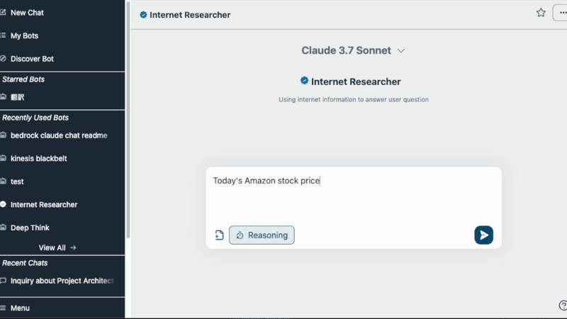

> [!คำเตือน]
>
> **เผยแพร่ V3 แล้ว กรุณาตรวจสอบ[คู่มือการย้ายระบบ](./migration/V2_TO_V3_th-TH.md) อย่างระมัดระวัง** หากไม่ระมัดระวัง **บอทจาก V2 จะใช้งานไม่ได้**

### การปรับแต่งบอท / ร้านค้าบอท

เพิ่มคำแนะนำและความรู้ของคุณเอง (หรือที่เรียกว่า [RAG](https://aws.amazon.com/what-is/retrieval-augmented-generation/)) บอทสามารถแบ่งปันระหว่างผู้ใช้แอปพลิเคชันผ่านตลาดร้านค้าบอท บอทที่กำหนดเองยังสามารถเผยแพร่เป็น API แบบสแตนด์อโลนได้ (ดู[รายละเอียด](./PUBLISH_API_th-TH.md))

<details>
<summary>ภาพหน้าจอ</summary>

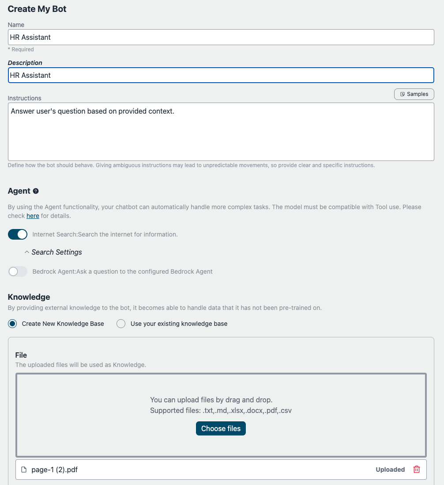
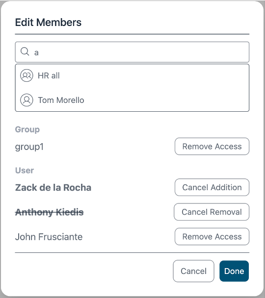
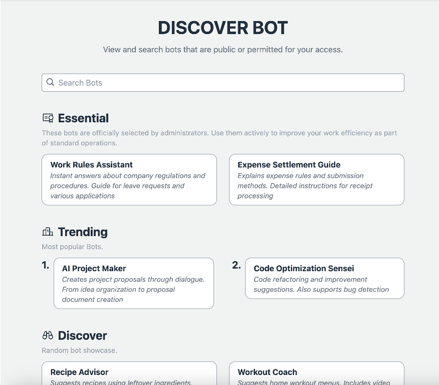
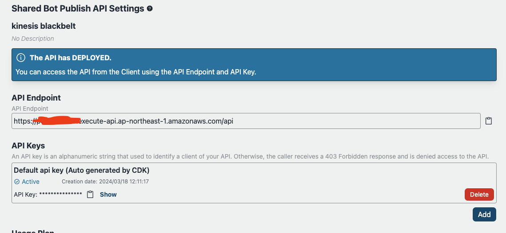

คุณยังสามารถนำเข้า [Amazon Bedrock's KnowledgeBase](https://aws.amazon.com/bedrock/knowledge-bases/) ที่มีอยู่

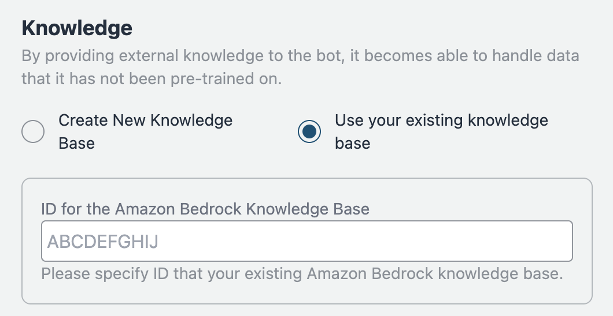

</details>

> [!สำคัญ]
> ด้วยเหตุผลทางการกำกับดูแล เฉพาะผู้ใช้ที่ได้รับอนุญาตเท่านั้นที่สามารถสร้างบอทที่กำหนดเองได้ เพื่ออนุญาตให้สร้างบอทที่กำหนดเอง ผู้ใช้ต้องเป็นสมาชิกของกลุ่มที่เรียกว่า `CreatingBotAllowed` ซึ่งสามารถตั้งค่าได้ผ่านคอนโซลการจัดการ > Amazon Cognito User pools หรือ aws cli โปรดทราบว่าสามารถอ้างอิง user pool id ได้จาก CloudFormation > BedrockChatStack > Outputs > `AuthUserPoolIdxxxx`

### คุณสมบัติการดูแลระบบ

การจัดการ API การทำเครื่องหมายบอทเป็นสำคัญ วิเคราะห์การใช้งานสำหรับบอท [รายละเอียด](./ADMINISTRATOR_th-TH.md)

<details>
<summary>ภาพหน้าจอ</summary>

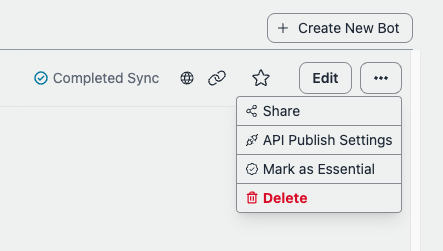

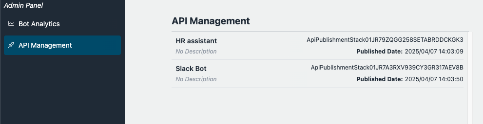
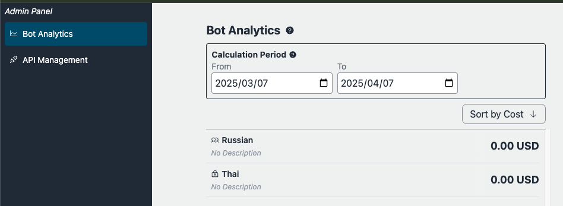)

</details>

### เอเจนต์

การใช้ [ฟังก์ชันเอเจนต์](./AGENT_th-TH.md) ช่วยให้แชทบอทของคุณสามารถจัดการงานที่ซับซ้อนได้โดยอัตโนมัติ ตัวอย่างเช่น เพื่อตอบคำถามของผู้ใช้ เอเจนต์สามารถดึงข้อมูลที่จำเป็นจากเครื่องมือภายนอกหรือแบ่งงานออกเป็นหลายขั้นตอนเพื่อประมวลผล

<details>
<summary>ภาพหน้าจอ</summary>


</details>

## 🚀 การปรับใช้งานแบบง่ายดาย

- ในภูมิภาค us-east-1 เปิด [การเข้าถึงโมเดล Bedrock](https://us-east-1.console.aws.amazon.com/bedrock/home?region=us-east-1#/modelaccess) > `จัดการการเข้าถึงโมเดล` > เลือกโมเดลที่คุณต้องการใช้งานทั้งหมด แล้วกด `บันทึกการเปลี่ยนแปลง`

<details>
<summary>ภาพหน้าจอ</summary>

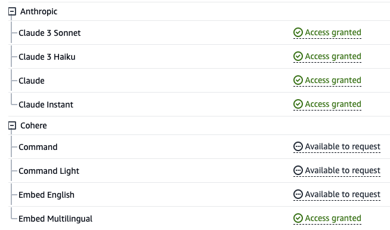

</details>

- เปิด [CloudShell](https://console.aws.amazon.com/cloudshell/home) ในภูมิภาคที่คุณต้องการปรับใช้งาน
- เรียกใช้การปรับใช้งานด้วยคำสั่งต่อไปนี้ หากคุณต้องการระบุเวอร์ชันที่จะปรับใช้งานหรือต้องการใช้นโยบายความปลอดภัย โปรดระบุพารามิเตอร์ที่เหมาะสมจาก [พารามิเตอร์เสริม](#พารามิเตอร์เสริม)

```sh
git clone https://github.com/aws-samples/bedrock-chat.git
cd bedrock-chat
chmod +x bin.sh
./bin.sh
```

- คุณจะได้รับการถามว่าเป็นผู้ใช้ใหม่หรือใช้ v3 หากคุณไม่ใช่ผู้ใช้ต่อเนื่องจาก v0 โปรดป้อน `y`

### พารามิเตอร์เสริม

คุณสามารถระบุพารามิเตอร์ต่อไปนี้ระหว่างการปรับใช้งานเพื่อเพิ่มความปลอดภัยและการปรับแต่ง:

- **--disable-self-register**: ปิดการลงทะเบียนด้วยตนเอง (ค่าเริ่มต้น: เปิดใช้งาน) หากตั้งค่านี้ คุณจะต้องสร้างผู้ใช้ทั้งหมดบน Cognito และจะไม่อนุญาตให้ผู้ใช้ลงทะเบียนบัญชีด้วยตนเอง
- **--enable-lambda-snapstart**: เปิดใช้งาน [Lambda SnapStart](https://docs.aws.amazon.com/lambda/latest/dg/snapstart.html) (ค่าเริ่มต้น: ปิดใช้งาน) หากตั้งค่านี้ จะปรับปรุงเวลาการเริ่มต้นแบบเย็นสำหรับฟังก์ชัน Lambda โดยให้เวลาตอบสนองที่เร็วขึ้นเพื่อประสบการณ์ผู้ใช้ที่ดีขึ้น
- **--ipv4-ranges**: รายการช่วง IPv4 ที่อนุญาตแบบคั่นด้วยเครื่องหมายจุลภาค (ค่าเริ่มต้น: อนุญาต IPv4 ทั้งหมด)
- **--ipv6-ranges**: รายการช่วง IPv6 ที่อนุญาตแบบคั่นด้วยเครื่องหมายจุลภาค (ค่าเริ่มต้น: อนุญาต IPv6 ทั้งหมด)
- **--disable-ipv6**: ปิดการเชื่อมต่อผ่าน IPv6 (ค่าเริ่มต้น: เปิดใช้งาน)
- **--allowed-signup-email-domains**: รายการโดเมนอีเมลที่อนุญาตสำหรับการลงทะเบียนแบบคั่นด้วยเครื่องหมายจุลภาค (ค่าเริ่มต้น: ไม่มีข้อจำกัดโดเมน)
- **--bedrock-region**: กำหนดภูมิภาคที่ Bedrock พร้อมใช้งาน (ค่าเริ่มต้น: us-east-1)
- **--repo-url**: ที่เก็บ Bedrock Chat แบบกำหนดเองเพื่อปรับใช้งาน หากทำการ fork หรือใช้การควบคุมแหล่งที่มาแบบกำหนดเอง (ค่าเริ่มต้น: https://github.com/aws-samples/bedrock-chat.git)
- **--version**: เวอร์ชันของ Bedrock Chat ที่จะปรับใช้งาน (ค่าเริ่มต้น: เวอร์ชันล่าสุดในการพัฒนา)
- **--cdk-json-override**: คุณสามารถแทนที่ค่าคอนเท็กซ์ CDK ใดๆ ระหว่างการปรับใช้งานโดยใช้บล็อก JSON แทนที่ นี่ช่วยให้คุณสามารถแก้ไขการกำหนดค่าโดยไม่ต้องแก้ไขไฟล์ cdk.json โดยตรง

ตัวอย่างการใช้งาน:

```bash
./bin.sh --cdk-json-override '{
  "context": {
    "selfSignUpEnabled": false,
    "enableLambdaSnapStart": true,
    "allowedIpV4AddressRanges": ["192.168.1.0/24"],
    "allowedSignUpEmailDomains": ["example.com"]
  }
}'
```

JSON แทนที่ต้องมีโครงสร้างเดียวกับ cdk.json คุณสามารถแทนที่ค่าคอนเท็กซ์ใดๆ รวมถึง:

- `selfSignUpEnabled`
- `enableLambdaSnapStart`
- `allowedIpV4AddressRanges`
- `allowedIpV6AddressRanges`
- `allowedSignUpEmailDomains`
- `bedrockRegion`
- `enableRagReplicas`
- `enableBedrockCrossRegionInference`
- และค่าคอนเท็กซ์อื่นๆ ที่กำหนดใน cdk.json

> [!หมายเหตุ]
> ค่าแทนที่จะถูกผสมกับการกำหนดค่า cdk.json ที่มีอยู่ระหว่างเวลาการปรับใช้งานใน AWS code build ค่าที่ระบุในการแทนที่จะมีความสำคัญเหนือค่าใน cdk.json

#### ตัวอย่างคำสั่งพร้อมพารามิเตอร์:

```sh
./bin.sh --disable-self-register --ipv4-ranges "192.0.2.0/25,192.0.2.128/25" --ipv6-ranges "2001:db8:1:2::/64,2001:db8:1:3::/64" --allowed-signup-email-domains "example.com,anotherexample.com" --bedrock-region "us-west-2" --version "v1.2.6"
```

- หลังจากประมาณ 35 นาที คุณจะได้รับผลลัพธ์ต่อไปนี้ ซึ่งคุณสามารถเข้าถึงได้จากเบราว์เซอร์ของคุณ

```
Frontend URL: https://xxxxxxxxx.cloudfront.net
```

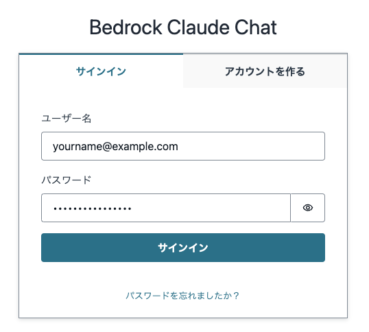

หน้าจอลงทะเบียนจะปรากฏขึ้นดังภาพข้างต้น ที่ซึ่งคุณสามารถลงทะเบียนอีเมลและเข้าสู่ระบบได้

> [!สำคัญ]
> หากไม่มีการตั้งค่าพารามิเตอร์เสริม วิธีการปรับใช้งานนี้จะอนุญาตให้ทุกคนที่ทราบ URL สามารถลงทะเบียนได้ สำหรับการใช้งานในระบบผลิต แนะนำอย่างยิ่งให้เพิ่มข้อจำกัด IP และปิดการลงทะเบียนด้วยตนเองเพื่อบรรเทาความเสี่ยงด้านความปลอดภัย (คุณสามารถกำหนด allowed-signup-email-domains เพื่อจำกัดผู้ใช้ให้เป็นเพียงที่อยู่อีเมลจากโดเมนบริษัทของคุณเท่านั้น) ใช้ ipv4-ranges และ ipv6-ranges สำหรับข้อจำกัด IP และปิดการลงทะเบียนด้วยตนเองโดยใช้ disable-self-register เมื่อเรียกใช้ ./bin

> [!เคล็ดลับ]
> หาก `Frontend URL` ไม่ปรากฏหรือ Bedrock Chat ไม่ทำงานอย่างถูกต้อง อาจเป็นปัญหาที่เวอร์ชันล่าสุด ในกรณีนี้ โปรดเพิ่ม `--version "v3.0.0"` ลงในพารามิเตอร์และลองปรับใช้งานอีกครั้ง

## สถาปัตยกรรม

เป็นสถาปัตยกรรมที่สร้างบนบริการที่จัดการโดย AWS โดยไม่ต้องจัดการโครงสร้างพื้นฐาน การใช้ Amazon Bedrock ทำให้ไม่จำเป็นต้องสื่อสารกับ API นอก AWS ซึ่งช่วยให้สามารถปรับใช้แอปพลิเคชันที่มีขนาดใหญ่ขึ้น เชื่อถือได้ และปลอดภัย

- [Amazon DynamoDB](https://aws.amazon.com/dynamodb/): ฐานข้อมูล NoSQL สำหรับจัดเก็บประวัติการสนทนา
- [Amazon API Gateway](https://aws.amazon.com/api-gateway/) + [AWS Lambda](https://aws.amazon.com/lambda/): จุดสิ้นสุด API แบ็กเอนด์ ([AWS Lambda Web Adapter](https://github.com/awslabs/aws-lambda-web-adapter), [FastAPI](https://fastapi.tiangolo.com/))
- [Amazon CloudFront](https://aws.amazon.com/cloudfront/) + [S3](https://aws.amazon.com/s3/): การส่งแอปพลิเคชันหน้าบ้าน ([React](https://react.dev/), [Tailwind CSS](https://tailwindcss.com/))
- [AWS WAF](https://aws.amazon.com/waf/): การจำกัดที่อยู่ IP
- [Amazon Cognito](https://aws.amazon.com/cognito/): การรับรองความถูกต้องของผู้ใช้
- [Amazon Bedrock](https://aws.amazon.com/bedrock/): บริการที่จัดการเพื่อใช้โมเดลพื้นฐานผ่าน API
- [Amazon Bedrock Knowledge Bases](https://aws.amazon.com/bedrock/knowledge-bases/): ให้อินเทอร์เฟซที่จัดการสำหรับการสร้างข้อมูลเสริม ([RAG](https://aws.amazon.com/what-is/retrieval-augmented-generation/)) โดยให้บริการสำหรับการฝังและแยกวิเคราะห์เอกสาร
- [Amazon EventBridge Pipes](https://aws.amazon.com/eventbridge/pipes/): รับเหตุการณ์จากสตรีม DynamoDB และเรียกใช้ Step Functions เพื่อฝังความรู้ภายนอก
- [AWS Step Functions](https://aws.amazon.com/step-functions/): การจัดเรียงลำดับขั้นตอนการรวบรวมข้อมูลเพื่อฝังความรู้ภายนอกใน Bedrock Knowledge Bases
- [Amazon OpenSearch Serverless](https://aws.amazon.com/opensearch-service/features/serverless/): ทำหน้าที่เป็นฐานข้อมูลแบ็กเอนด์สำหรับ Bedrock Knowledge Bases โดยให้ความสามารถค้นหาแบบเต็มข้อความและการค้นหาแบบเวกเตอร์ ช่วยให้สามารถดึงข้อมูลที่เกี่ยวข้องได้อย่างแม่นยำ
- [Amazon Athena](https://aws.amazon.com/athena/): บริการสอบถามเพื่อวิเคราะห์บัคเก็ต S3

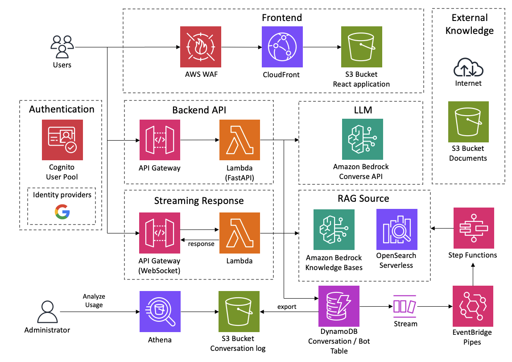

## การปรับใช้งานด้วย CDK

การปรับใช้งานแบบง่ายๆ ใช้ [AWS CodeBuild](https://aws.amazon.com/codebuild/) เพื่อดำเนินการปรับใช้งานด้วย CDK ภายใน ส่วนนี้อธิบายขั้นตอนการปรับใช้งานโดยตรงด้วย CDK

- กรุณามี UNIX, Docker และสภาพแวดล้อมการทำงานของ Node.js หากไม่มี คุณสามารถใช้ [Cloud9](https://github.com/aws-samples/cloud9-setup-for-prototyping)

> [!สำคัญ]
> หากมีพื้นที่จัดเก็บข้อมูลไม่เพียงพอในสภาพแวดล้อมภายในเครื่องระหว่างการปรับใช้งาน CDK bootstrapping อาจส่งผลให้เกิดข้อผิดพลาด หากคุณกำลังทำงานใน Cloud9 เป็นต้น เราขอแนะนำให้ขยายขนาดของปริมาตรอินสแตนซ์ก่อนการปรับใช้งาน

- โคลนที่เก็บโค้ดนี้

```
git clone https://github.com/aws-samples/bedrock-chat
```

- ติดตั้งแพ็คเกจ npm

```
cd bedrock-chat
cd cdk
npm ci
```

- หากจำเป็น ให้แก้ไขรายการต่อไปนี้ใน [cdk.json](./cdk/cdk.json) หากจำเป็น

  - `bedrockRegion`: ภูมิภาคที่ Bedrock พร้อมใช้งาน **หมายเหตุ: Bedrock ยังไม่รองรับทุกภูมิภาคในขณะนี้**
  - `allowedIpV4AddressRanges`, `allowedIpV6AddressRanges`: ช่วง IP Address ที่อนุญาต
  - `enableLambdaSnapStart`: ค่าเริ่มต้นคือ true ตั้งค่าเป็น false หากปรับใช้งานในภูมิภาคที่ไม่รองรับ Lambda SnapStart สำหรับฟังก์ชัน Python

- ก่อนปรับใช้งาน CDK คุณจำเป็นต้องทำ Bootstrap สำหรับภูมิภาคที่คุณกำลังปรับใช้งาน

```
npx cdk bootstrap
```

- ปรับใช้งานโครงการตัวอย่างนี้

```
npx cdk deploy --require-approval never --all
```

- คุณจะได้ผลลัพธ์คล้ายกับด้านล่าง URL ของเว็บแอปจะแสดงใน `BedrockChatStack.FrontendURL` โปรดเข้าถึงจากเบราว์เซอร์ของคุณ

```sh
 ✅  BedrockChatStack

✨  Deployment time: 78.57s

Outputs:
BedrockChatStack.AuthUserPoolClientIdXXXXX = xxxxxxx
BedrockChatStack.AuthUserPoolIdXXXXXX = ap-northeast-1_XXXX
BedrockChatStack.BackendApiBackendApiUrlXXXXX = https://xxxxx.execute-api.ap-northeast-1.amazonaws.com
BedrockChatStack.FrontendURL = https://xxxxx.cloudfront.net
```

### กำหนดพารามิเตอร์

คุณสามารถกำหนดพารามิเตอร์สำหรับการปรับใช้งานได้สองวิธี: โดยใช้ `cdk.json` หรือใช้ไฟล์ `parameter.ts` ที่ปลอดภัยแบบ type-safe

#### การใช้ cdk.json (วิธีดั้งเดิม)

วิธีดั้งเดิมในการกำหนดค่าพารามิเตอร์คือการแก้ไขไฟล์ `cdk.json` วิธีนี้ง่ายแต่ขาดการตรวจสอบชนิด:

```json
{
  "app": "npx ts-node --prefer-ts-exts bin/bedrock-chat.ts",
  "context": {
    "bedrockRegion": "us-east-1",
    "allowedIpV4AddressRanges": ["0.0.0.0/1", "128.0.0.0/1"],
    "selfSignUpEnabled": true
  }
}
```

#### การใช้ parameter.ts (วิธีที่แนะนำแบบ Type-Safe)

สำหรับความปลอดภัยและประสบการณ์การพัฒนาที่ดีขึ้น คุณสามารถใช้ไฟล์ `parameter.ts` เพื่อกำหนดพารามิเตอร์ของคุณ:

```typescript
// กำหนดพารามิเตอร์สำหรับสภาพแวดล้อมเริ่มต้น
bedrockChatParams.set("default", {
  bedrockRegion: "us-east-1",
  allowedIpV4AddressRanges: ["192.168.0.0/16"],
  selfSignUpEnabled: true,
});

// กำหนดพารามิเตอร์สำหรับสภาพแวดล้อมเพิ่มเติม
bedrockChatParams.set("dev", {
  bedrockRegion: "us-west-2",
  allowedIpV4AddressRanges: ["10.0.0.0/8"],
  enableRagReplicas: false, // ประหยัดต้นทุนสำหรับสภาพแวดล้อมการพัฒนา
  enableBotStoreReplicas: false, // ประหยัดต้นทุนสำหรับสภาพแวดล้อมการพัฒนา
});

bedrockChatParams.set("prod", {
  bedrockRegion: "us-east-1",
  allowedIpV4AddressRanges: ["172.16.0.0/12"],
  enableLambdaSnapStart: true,
  enableRagReplicas: true, // เพิ่มความพร้อมใช้งานสำหรับการผลิต
  enableBotStoreReplicas: true, // เพิ่มความพร้อมใช้งานสำหรับการผลิต
});
```

> [!บันทึก]
> ผู้ใช้ปัจจุบันสามารถใช้ `cdk.json` ต่อไปได้โดยไม่มีการเปลี่ยนแปลง วิธีการใช้ `parameter.ts` แนะนำสำหรับการปรับใช้งานใหม่หรือเมื่อคุณต้องจัดการหลายสภาพแวดล้อม

### การปรับใช้งานหลายสภาพแวดล้อม

คุณสามารถปรับใช้งานหลายสภาพแวดล้อมจากฐานโค้ดเดียวกันโดยใช้ไฟล์ `parameter.ts` และตัวเลือก `-c envName`

#### ข้อกำหนดเบื้องต้น

1. กำหนดสภาพแวดล้อมของคุณใน `parameter.ts` ตามที่แสดงข้างต้น
2. แต่ละสภาพแวดล้อมจะมีทรัพยากรของตนเองพร้อมคำนำหน้าเฉพาะสภาพแวดล้อม

#### คำสั่งการปรับใช้งาน

เพื่อปรับใช้งานสภาพแวดล้อมเฉพาะ:

```bash
# ปรับใช้งานสภาพแวดล้อม dev
npx cdk deploy --all -c envName=dev

# ปรับใช้งานสภาพแวดล้อม prod
npx cdk deploy --all -c envName=prod
```

หากไม่มีการระบุสภาพแวดล้อม จะใช้สภาพแวดล้อม "default":

```bash
# ปรับใช้งานสภาพแวดล้อมเริ่มต้น
npx cdk deploy --all
```

#### บันทึกสำคัญ

1. **การตั้งชื่อสแต็ค**:
   - สแต็คหลักสำหรับแต่ละสภาพแวดล้อมจะมีคำนำหน้าชื่อด้วยชื่อสภาพแวดล้อม (เช่น `dev-BedrockChatStack`, `prod-BedrockChatStack`)
   - อย่างไรก็ตาม สแต็คบอทแบบกำหนดเองและสแต็คการเผยแพร่ API จะไม่ได้รับคำนำหน้าสภาพแวดล้อม เนื่องจากถูกสร้างแบบไดนามิกในระหว่างการทำงาน

2. **การตั้งชื่อทรัพยากร**:
   - เพียงบางทรัพยากรเท่านั้นที่ได้รับคำนำหน้าสภาพแวดล้อมในชื่อ (เช่น ตาราง `dev_ddb_export`, `dev-FrontendWebAcl`)
   - ทรัพยากรส่วนใหญ่คงชื่อเดิม แต่แยกออกจากกันโดยอยู่ในสแต็คที่ต่างกัน

3. **การระบุสภาพแวดล้อม**:
   - ทรัพยากรทั้งหมดจะถูกติดแท็ก `CDKEnvironment` ที่มีชื่อสภาพแวดล้อม
   - คุณสามารถใช้แท็กนี้เพื่อระบุว่าทรัพยากรใดอยู่ในสภาพแวดล้อมใด
   - ตัวอย่าง: `CDKEnvironment: dev` หรือ `CDKEnvironment: prod`

4. **การแทนที่สภาพแวดล้อมเริ่มต้น**: หากคุณกำหนดสภาพแวดล้อม "default" ใน `parameter.ts` จะแทนที่การตั้งค่าใน `cdk.json` เพื่อยังคงใช้ `cdk.json` ให้ไม่ต้องกำหนดสภาพแวดล้อม "default" ใน `parameter.ts`

5. **ข้อกำหนดสภาพแวดล้อม**: เพื่อสร้างสภาพแวดล้อมอื่นนอกเหนือจาก "default" คุณต้องใช้ `parameter.ts` ตัวเลือก `-c envName` เพียงอย่างเดียวไม่เพียงพอโดยไม่มีการกำหนดสภาพแวดล้อมที่สอดคล้องกัน

6. **การแยกทรัพยากร**: แต่ละสภาพแวดล้อมสร้างชุดทรัพยากรของตนเอง ช่วยให้คุณสามารถมีสภาพแวดล้อมการพัฒนา การทดสอบ และการผลิตในบัญชี AWS เดียวกันโดยไม่มีความขัดแย้ง

## อื่นๆ

คุณสามารถกำหนดพารามิเตอร์สำหรับการปรับใช้งานได้สองวิธี: โดยใช้ `cdk.json` หรือใช้ไฟล์ `parameter.ts` ที่ปลอดภัยด้านประเภท

#### การใช้ cdk.json (วิธีดั้งเดิม)

วิธีดั้งเดิมในการกำหนดค่าพารามิเตอร์คือการแก้ไขไฟล์ `cdk.json` วิธีนี้เรียบง่ายแต่ขาดการตรวจสอบประเภท:

```json
{
  "app": "npx ts-node --prefer-ts-exts bin/bedrock-chat.ts",
  "context": {
    "bedrockRegion": "us-east-1",
    "allowedIpV4AddressRanges": ["0.0.0.0/1", "128.0.0.0/1"],
    "selfSignUpEnabled": true
  }
}
```

#### การใช้ parameter.ts (วิธีที่แนะนำสำหรับความปลอดภัยด้านประเภท)

สำหรับความปลอดภัยด้านประเภทและประสบการณ์นักพัฒนาที่ดีขึ้น คุณสามารถใช้ไฟล์ `parameter.ts` เพื่อกำหนดพารามิเตอร์ของคุณ:

```typescript
// กำหนดพารามิเตอร์สำหรับสภาพแวดล้อมเริ่มต้น
bedrockChatParams.set("default", {
  bedrockRegion: "us-east-1",
  allowedIpV4AddressRanges: ["192.168.0.0/16"],
  selfSignUpEnabled: true,
});

// กำหนดพารามิเตอร์สำหรับสภาพแวดล้อมเพิ่มเติม
bedrockChatParams.set("dev", {
  bedrockRegion: "us-west-2",
  allowedIpV4AddressRanges: ["10.0.0.0/8"],
  enableRagReplicas: false, // ประหยัดต้นทุนสำหรับสภาพแวดล้อมการพัฒนา
});

bedrockChatParams.set("prod", {
  bedrockRegion: "us-east-1",
  allowedIpV4AddressRanges: ["172.16.0.0/12"],
  enableLambdaSnapStart: true,
  enableRagReplicas: true, // เพิ่มความพร้อมใช้งานสำหรับการผลิต
});
```

> [!หมายเหตุ]
> ผู้ใช้ปัจจุบันสามารถใช้ `cdk.json` ต่อไปได้โดยไม่มีการเปลี่ยนแปลง วิธี `parameter.ts` แนะนำสำหรับการปรับใช้งานใหม่หรือเมื่อคุณต้องจัดการหลายสภาพแวดล้อม

### การปรับใช้งานหลายสภาพแวดล้อม

คุณสามารถปรับใช้งานหลายสภาพแวดล้อมจากโค้ดเดียวกันโดยใช้ไฟล์ `parameter.ts` และตัวเลือก `-c envName`

#### ข้อกำหนดเบื้องต้น

1. กำหนดสภาพแวดล้อมของคุณใน `parameter.ts` ตามที่แสดงด้านบน
2. แต่ละสภาพแวดล้อมจะมีทรัพยากรของตนเองพร้อมคำนำหน้าเฉพาะสภาพแวดล้อม

#### คำสั่งการปรับใช้งาน

เพื่อปรับใช้งานสภาพแวดล้อมเฉพาะ:

```bash
# ปรับใช้งานสภาพแวดล้อม dev
npx cdk deploy --all -c envName=dev

# ปรับใช้งานสภาพแวดล้อม prod
npx cdk deploy --all -c envName=prod
```

หากไม่ระบุสภาพแวดล้อม สภาพแวดล้อม "default" จะถูกใช้:

```bash
# ปรับใช้งานสภาพแวดล้อมเริ่มต้น
npx cdk deploy --all
```

#### หมายเหตุสำคัญ

1. **การตั้งชื่อสแต็ก**:

   - สแต็กหลักสำหรับแต่ละสภาพแวดล้อมจะมีคำนำหน้าชื่อสภาพแวดล้อม (เช่น `dev-BedrockChatStack`, `prod-BedrockChatStack`)
   - อย่างไรก็ตาม สแต็กบอทที่กำหนดเอง (`BrChatKbStack*`) และสแต็กการเผยแพร่ API (`ApiPublishmentStack*`) จะไม่ได้รับคำนำหน้าสภาพแวดล้อมเนื่องจากถูกสร้างแบบไดนามิกขณะรันไทม์

2. **การตั้งชื่อทรัพยากร**:

   - เพียงบางทรัพยากรเท่านั้นที่ได้รับคำนำหน้าสภาพแวดล้อมในชื่อ (เช่น ตาราง `dev_ddb_export`, `dev-FrontendWebAcl`)
   - ทรัพยากรส่วนใหญ่คงชื่อเดิมแต่แยกออกโดยอยู่ในสแต็กที่แตกต่างกัน

3. **การระบุสภาพแวดล้อม**:

   - ทรัพยากรทั้งหมดจะมีแท็ก `CDKEnvironment` ที่มีชื่อสภาพแวดล้อม
   - คุณสามารถใช้แท็กนี้เพื่อระบุว่าทรัพยากรใดอยู่ในสภาพแวดล้อมใด
   - ตัวอย่าง: `CDKEnvironment: dev` หรือ `CDKEnvironment: prod`

4. **การแทนที่สภาพแวดล้อมเริ่มต้น**: หากคุณกำหนดสภาพแวดล้อม "default" ใน `parameter.ts` จะแทนที่การตั้งค่าใน `cdk.json` เพื่อใช้ `cdk.json` ต่อไป ไม่ต้องกำหนดสภาพแวดล้อม "default" ใน `parameter.ts`

5. **ข้อกำหนดสภาพแวดล้อม**: เพื่อสร้างสภาพแวดล้อมอื่นนอกเหนือจาก "default" คุณต้องใช้ `parameter.ts` ตัวเลือก `-c envName` เพียงอย่างเดียวไม่เพียงพอโดยไม่มีการกำหนดสภาพแวดล้อมที่สอดคล้อง

6. **การแยกทรัพยากร**: แต่ละสภาพแวดล้อมสร้างชุดทรัพยากรของตนเอง ช่วยให้คุณสามารถมีสภาพแวดล้อมการพัฒนา การทดสอบ และการผลิตในบัญชี AWS เดียวกันโดยไม่มีความขัดแย้ง

## อื่นๆ

### ลบทรัพยากร

หากใช้ CLI และ CDK ให้ใช้คำสั่ง `npx cdk destroy` หากไม่ใช่ ให้เข้าไปที่ [CloudFormation](https://console.aws.amazon.com/cloudformation/home) แล้วลบ `BedrockChatStack` และ `FrontendWafStack` ด้วยตนเอง โปรดทราบว่า `FrontendWafStack` อยู่ในภูมิภาค `us-east-1`

### การตั้งค่าภาษา

แอสเสทนี้ตรวจจับภาษาโดยอัตโนมัติโดยใช้ [i18next-browser-languageDetector](https://github.com/i18next/i18next-browser-languageDetector) คุณสามารถสลับภาษาได้จากเมนูแอปพลิเคชัน หรือสามารถใช้ Query String เพื่อตั้งภาษาได้ดังนี้

> `https://example.com?lng=ja`

### ปิดการลงทะเบียนด้วยตนเอง

ตัวอย่างนี้เปิดการลงทะเบียนด้วยตนเองตามค่าเริ่มต้น หากต้องการปิดการลงทะเบียนด้วยตนเอง ให้เปิด [cdk.json](./cdk/cdk.json) และเปลี่ยน `selfSignUpEnabled` เป็น `false` หากคุณกำหนดค่า [ผู้ให้บริการยืนยันตัวตนภายนอก](#external-identity-provider) ค่านี้จะถูกละเว้นและปิดการใช้งานโดยอัตโนมัติ

### จำกัดโดเมนสำหรับที่อยู่อีเมลลงทะเบียน

ตามค่าเริ่มต้น ตัวอย่างนี้ไม่จำกัดโดเมนสำหรับที่อยู่อีเมลลงทะเบียน หากต้องการอนุญาตให้ลงทะเบียนเฉพาะโดเมนเฉพาะ ให้เปิด `cdk.json` และระบุโดเมนเป็นรายการใน `allowedSignUpEmailDomains`

```ts
"allowedSignUpEmailDomains": ["example.com"],
```

### ผู้ให้บริการยืนยันตัวตนภายนอก

ตัวอย่างนี้รองรับผู้ให้บริการยืนยันตัวตนภายนอก ปัจจุบันรองรับ [Google](./idp/SET_UP_GOOGLE_th-TH.md) และ [ผู้ให้บริการ OIDC แบบกำหนดเอง](./idp/SET_UP_CUSTOM_OIDC_th-TH.md)

### เพิ่มผู้ใช้ใหม่ในกลุ่มโดยอัตโนมัติ

ตัวอย่างนี้มีกลุ่มต่อไปนี้เพื่อให้สิทธิ์แก่ผู้ใช้:

- [`Admin`](./ADMINISTRATOR_th-TH.md)
- [`CreatingBotAllowed`](#bot-personalization)
- [`PublishAllowed`](./PUBLISH_API_th-TH.md)

หากต้องการให้ผู้ใช้ที่สร้างใหม่เข้าร่วมกลุ่มโดยอัตโนมัติ คุณสามารถระบุได้ใน [cdk.json](./cdk/cdk.json)

```json
"autoJoinUserGroups": ["CreatingBotAllowed"],
```

ตามค่าเริ่มต้น ผู้ใช้ที่สร้างใหม่จะเข้าร่วมกลุ่ม `CreatingBotAllowed`

### กำหนดค่าการทำซ้ำ RAG

`enableRagReplicas` เป็นตัวเลือกใน [cdk.json](./cdk/cdk.json) ที่ควบคุมการตั้งค่าการทำซ้ำสำหรับฐานข้อมูล RAG โดยเฉพาะ Knowledge Bases ที่ใช้ Amazon OpenSearch Serverless

- **ค่าเริ่มต้น**: true
- **true**: เพิ่มความพร้อมใช้งานโดยเปิดใช้งานการทำซ้ำเพิ่มเติม เหมาะสำหรับสภาพแวดล้อมการผลิตแต่เพิ่มค่าใช้จ่าย
- **false**: ลดค่าใช้จ่ายโดยใช้การทำซ้ำน้อยลง เหมาะสำหรับการพัฒนาและทดสอบ

นี่เป็นการตั้งค่าระดับบัญชี/ภูมิภาค ส่งผลกระทบต่อแอปพลิเคชันทั้งหมดแทนที่จะเป็นบอทเดี่ยว

> [!หมายเหตุ]
> ตั้งแต่เดือนมิถุนายน 2024 Amazon OpenSearch Serverless รองรับ 0.5 OCU ลดต้นทุนการเข้าถึงสำหรับงานขนาดเล็ก การปรับใช้งานในการผลิตสามารถเริ่มต้นที่ 2 OCUs ในขณะที่งานพัฒนา/ทดสอบสามารถใช้ 1 OCU OpenSearch Serverless จะปรับขนาดอัตโนมัติตามความต้องการของงาน สำหรับรายละเอียดเพิ่มเติม โปรดไปที่ [ประกาศ](https://aws.amazon.com/jp/about-aws/whats-new/2024/06/amazon-opensearch-serverless-entry-cost-half-collection-types/)

### กำหนดค่าร้านค้าบอท

คุณสมบัติร้านค้าบอทอนุญาตให้ผู้ใช้แบ่งปันและค้นพบบอทแบบกำหนดเอง คุณสามารถกำหนดค่าร้านค้าบอทผ่านการตั้งค่าต่อไปนี้ใน [cdk.json](./cdk/cdk.json):

```json
{
  "context": {
    "enableBotStore": true,
    "enableBotStoreReplicas": false,
    "botStoreLanguage": "en"
  }
}
```

- **enableBotStore**: ควบคุมว่าเปิดใช้งานคุณสมบัติร้านค้าบอทหรือไม่ (ค่าเริ่มต้น: `true`)
- **botStoreLanguage**: กำหนดภาษาหลักสำหรับการค้นหาและค้นพบบอท (ค่าเริ่มต้น: `"en"`) ซึ่งส่งผลต่อวิธีการจัดทำดัชนีและค้นหาบอทในร้านค้าบอท โดยปรับการวิเคราะห์ข้อความสำหรับภาษาที่ระบุ
- **enableBotStoreReplicas**: ควบคุมว่าเปิดใช้งานการทำซ้ำสแตนด์บายสำหรับคอลเลกชัน OpenSearch Serverless ที่ใช้โดยร้านค้าบอทหรือไม่ (ค่าเริ่มต้น: `false`) การตั้งค่าเป็น `true` จะปรับปรุงความพร้อมใช้งานแต่เพิ่มค่าใช้จ่าย ขณะที่ `false` จะลดค่าใช้จ่ายแต่อาจส่งผลกระทบต่อความพร้อมใช้งาน
  > **สำคัญ**: คุณไม่สามารถอัปเดตคุณสมบัตินี้หลังจากสร้างคอลเลกชันแล้ว หากพยายามแก้ไขคุณสมบัตินี้ คอลเลกชันจะยังคงใช้ค่าดั้งเดิม

### การอนุมานข้ามภูมิภาค

[การอนุมานข้ามภูมิภาค](https://docs.aws.amazon.com/bedrock/latest/userguide/inference-profiles-support.html) อนุญาตให้ Amazon Bedrock กำหนดเส้นทางคำขออนุมานแบบไดนามิกข้ามหลายภูมิภาค AWS เพื่อเพิ่มค่าความสามารถในการรองรับและความทนทานในช่วงความต้องการสูงสุด หากต้องการกำหนดค่า ให้แก้ไข `cdk.json`

```json
"enableBedrockCrossRegionInference": true
```

### Lambda SnapStart

[Lambda SnapStart](https://docs.aws.amazon.com/lambda/latest/dg/snapstart.html) ปรับปรุงเวลาเริ่มต้นแบบเย็นสำหรับฟังก์ชัน Lambda เพื่อให้ได้เวลาตอบสนองที่เร็วขึ้นสำหรับประสบการณ์ผู้ใช้ที่ดีขึ้น ในทางกลับกัน สำหรับฟังก์ชัน Python มีค่าธรรมเนียม[ขึ้นอยู่กับขนาดแคช](https://aws.amazon.com/lambda/pricing/#SnapStart_Pricing) และ[ไม่พร้อมใช้งานในบางภูมิภาค](https://docs.aws.amazon.com/lambda/latest/dg/snapstart.html#snapstart-supported-regions) ในปัจจุบัน หากต้องการปิดใช้งาน SnapStart ให้แก้ไข `cdk.json`

```json
"enableLambdaSnapStart": false
```

### กำหนดโดเมนแบบกำหนดเอง

คุณสามารถกำหนดโดเมนแบบกำหนดเองสำหรับการกระจาย CloudFront โดยตั้งพารามิเตอร์ต่อไปนี้ใน [cdk.json](./cdk/cdk.json):

```json
{
  "alternateDomainName": "chat.example.com",
  "hostedZoneId": "Z0123456789ABCDEF"
}
```

- `alternateDomainName`: ชื่อโดเมนแบบกำหนดเองสำหรับแอปพลิเคชันแชทของคุณ (เช่น chat.example.com)
- `hostedZoneId`: รหัสโซนที่โฮสต์ Route 53 ที่จะสร้างระเบียน DNS

เมื่อมีการระบุพารามิเตอร์เหล่านี้ การปรับใช้จะดำเนินการโดยอัตโนมัติ:

- สร้างใบรับรอง ACM ด้วยการตรวจสอบ DNS ในภูมิภาค us-east-1
- สร้างระเบียน DNS ที่จำเป็นในโซนที่โฮสต์ Route 53 ของคุณ
- กำหนดค่า CloudFront ให้ใช้โดเมนแบบกำหนดเองของคุณ

> [!หมายเหตุ]
> โดเมนต้องจัดการโดย Route 53 ในบัญชี AWS ของคุณ รหัสโซนที่โฮสต์สามารถพบได้ในคอนโซล Route 53

### การพัฒนาในเครื่อง

ดู [การพัฒนาในเครื่อง](./LOCAL_DEVELOPMENT_th-TH.md)

### การมีส่วนร่วม

ขอบคุณที่พิจารณาการมีส่วนร่วมในที่เก็บนี้! เรายินดีรับการแก้ไขบั๊ก การแปลภาษา (i18n) การปรับปรุงคุณสมบัติ [เครื่องมือเอเจนต์](./docs/AGENT.md#how-to-develop-your-own-tools) และการปรับปรุงอื่นๆ

สำหรับการปรับปรุงคุณสมบัติและการปรับปรุงอื่นๆ **ก่อนสร้าง Pull Request เราจะขอบคุณเป็นอย่างยิ่งหากคุณสามารถสร้าง Feature Request Issue เพื่ออภิปรายแนวทางการดำเนินการและรายละเอียด สำหรับการแก้ไขบั๊กและการแปลภาษา (i18n) ให้ดำเนินการสร้าง Pull Request โดยตรง**

โปรดดูแนวทางต่อไปนี้ก่อน

## ผู้ติดต่อ

- [Takehiro Suzuki](https://github.com/statefb)
- [Yusuke Wada](https://github.com/wadabee)
- [Yukinobu Mine](https://github.com/Yukinobu-Mine)

## 🏆 ผู้มีส่วนร่วมสำคัญ

- [fsatsuki](https://github.com/fsatsuki)
- [k70suK3-k06a7ash1](https://github.com/k70suK3-k06a7ash1)

## ผู้มีส่วนร่วม

[](https://github.com/aws-samples/bedrock-chat/graphs/contributors)

## สัญญาอนุญาต

ไลบรารีนี้อยู่ภายใต้ใบอนุญาต MIT-0 โปรดดู[ไฟล์ LICENSE](./LICENSE)