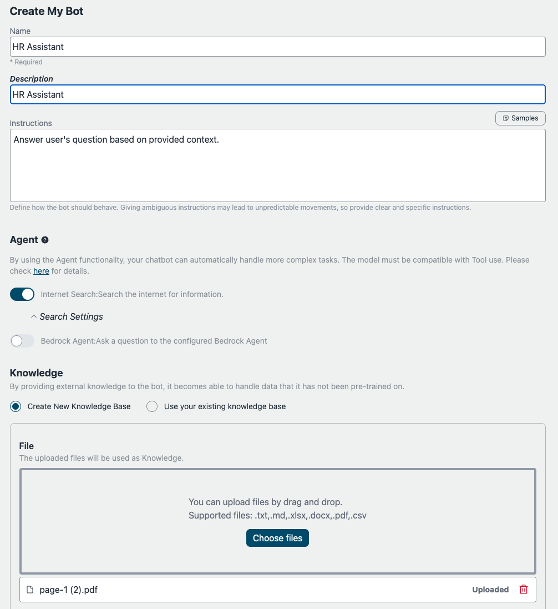
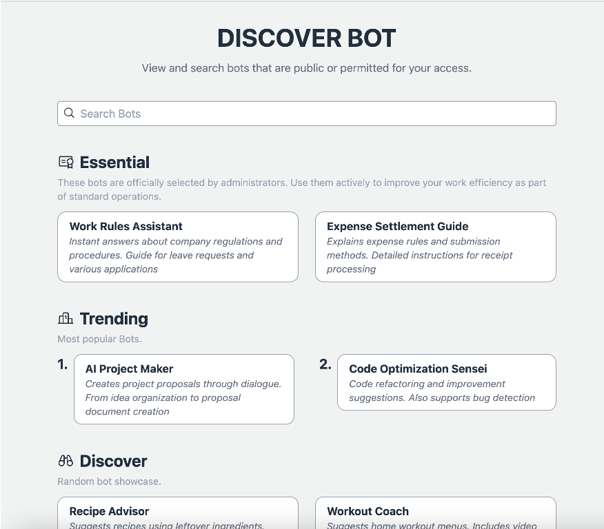
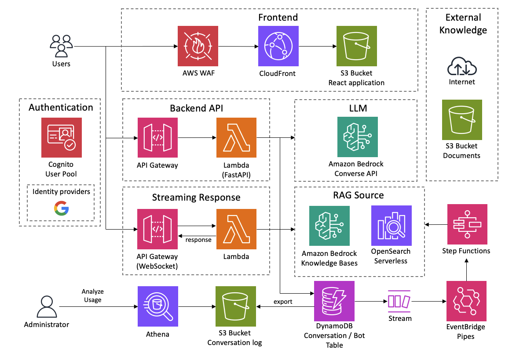

<h1 align="center">Bedrock Chat (BrChat)</h1>

<p align="center">
  
  
  
  <a href="https://github.com/aws-samples/bedrock-chat/issues?q=is%3Aissue%20state%3Aopen%20label%3Aroadmap">
    
  </a>
</p>

[English](https://github.com/aws-samples/bedrock-chat/blob/v3/README.md) | [日本語](https://github.com/aws-samples/bedrock-chat/blob/v3/docs/README_ja-JP.md) | [한국어](https://github.com/aws-samples/bedrock-chat/blob/v3/docs/README_ko-KR.md) | [中文](https://github.com/aws-samples/bedrock-chat/blob/v3/docs/README_zh-CN.md) | [Français](https://github.com/aws-samples/bedrock-chat/blob/v3/docs/README_fr-FR.md) | [Deutsch](https://github.com/aws-samples/bedrock-chat/blob/v3/docs/README_de-DE.md) | [Español](https://github.com/aws-samples/bedrock-chat/blob/v3/docs/README_es-ES.md) | [Italian](https://github.com/aws-samples/bedrock-chat/blob/v3/docs/README_it-IT.md) | [Norsk](https://github.com/aws-samples/bedrock-chat/blob/v3/docs/README_nb-NO.md) | [ไทย](https://github.com/aws-samples/bedrock-chat/blob/v3/docs/README_th-TH.md) | [Bahasa Indonesia](https://github.com/aws-samples/bedrock-chat/blob/v3/docs/README_id-ID.md) | [Bahasa Melayu](https://github.com/aws-samples/bedrock-chat/blob/v3/docs/README_ms-MY.md) | [Tiếng Việt](https://github.com/aws-samples/bedrock-chat/blob/v3/docs/README_vi-VN.md) | [Polski](https://github.com/aws-samples/bedrock-chat/blob/v3/docs/README_pl-PL.md) | [Português Brasil](https://github.com/aws-samples/bedrock-chat/blob/v3/docs/README_pt-BR.md)

一個由 [Amazon Bedrock](https://aws.amazon.com/bedrock/) 驅動的多語言生成式人工智能平台。
支持聊天、自訂知識機器人（RAG）、通過機器人商店共享機器人，以及使用代理進行任務自動化。


> [!Warning]
>
> **V3 已發布。要更新，請仔細查看 [遷移指南](./migration/V2_TO_V3_zh-TW.md)。** 不小心的話，**V2 的機器人將無法使用。**

### 機器人個性化 / 機器人商店

添加您自己的指令和知識（又稱 [RAG](https://aws.amazon.com/what-is/retrieval-augmented-generation/)）。機器人可以通過機器人商店市場在應用程序用戶之間共享。自定義機器人還可以發布為獨立的 API（請參閱 [詳情](./PUBLISH_API_zh-TW.md)）。

<details>
<summary>截圖</summary>






您還可以導入現有的 [Amazon Bedrock 知識庫](https://aws.amazon.com/bedrock/knowledge-bases/)。


</details>

> [!Important]
> 出於治理原因，只有允許的用戶才能創建自定義機器人。要允許創建自定義機器人，用戶必須是名為 `CreatingBotAllowed` 的組的成員，可以通過管理控制台 > Amazon Cognito 用戶池或 AWS CLI 設置。請注意，用戶池 ID 可以通過訪問 CloudFormation > BedrockChatStack > 輸出 > `AuthUserPoolIdxxxx` 來引用。

### 管理功能

API 管理、標記重要機器人、分析機器人使用情況。[詳情](./ADMINISTRATOR_zh-TW.md)

<details>
<summary>截圖</summary>


)

</details>

### 代理

通過使用 [代理功能](./AGENT_zh-TW.md)，您的聊天機器人可以自動處理更複雜的任務。例如，要回答用戶的問題，代理可以從外部工具檢索必要的信息，或將任務分解為多個步驟進行處理。

<details>
<summary>截圖</summary>


</details>

## 🚀 超級簡單的部署

- 在 us-east-1 區域，開啟 [Bedrock 模型存取](https://us-east-1.console.aws.amazon.com/bedrock/home?region=us-east-1#/modelaccess) > `管理模型存取` > 勾選您想使用的所有模型，然後點選 `儲存變更`。

<details>
<summary>螢幕截圖</summary>


</details>

- 在您要部署的區域開啟 [CloudShell](https://console.aws.amazon.com/cloudshell/home)
- 透過以下指令執行部署。如果您想指定要部署的版本或需要套用安全策略，請從[可選參數](#可選參數)中指定適當的參數。

```sh
git clone https://github.com/aws-samples/bedrock-chat.git
cd bedrock-chat
chmod +x bin.sh
./bin.sh
```

- 系統會詢問是否為新使用者或使用 v3。如果您不是 v0 的持續使用者，請輸入 `y`。

### 可選參數

您可以在部署期間指定以下參數以增強安全性和自訂性：

- **--disable-self-register**：停用自行註冊（預設：啟用）。如果設定此標誌，您將需要在 Cognito 上建立所有使用者，且不允許使用者自行註冊帳戶。
- **--enable-lambda-snapstart**：啟用 [Lambda SnapStart](https://docs.aws.amazon.com/lambda/latest/dg/snapstart.html)（預設：停用）。如果設定此標誌，可改善 Lambda 函數的冷啟動時間，提供更快的回應時間，以獲得更好的使用者體驗。
- **--ipv4-ranges**：允許的 IPv4 範圍的逗號分隔清單。（預設：允許所有 IPv4 位址）
- **--ipv6-ranges**：允許的 IPv6 範圍的逗號分隔清單。（預設：允許所有 IPv6 位址）
- **--disable-ipv6**：停用 IPv6 連線。（預設：啟用）
- **--allowed-signup-email-domains**：允許註冊的電子郵件網域的逗號分隔清單。（預設：無網域限制）
- **--bedrock-region**：定義 Bedrock 可用的區域。（預設：us-east-1）
- **--repo-url**：要部署的 Bedrock Chat 自訂儲存庫，如果已分支或使用自訂原始碼控制。（預設：https://github.com/aws-samples/bedrock-chat.git）
- **--version**：要部署的 Bedrock Chat 版本。（預設：開發中的最新版本）
- **--cdk-json-override**：您可以使用覆寫 JSON 區塊在部署期間覆寫任何 CDK 上下文值。這允許您在不直接編輯 cdk.json 檔案的情況下修改配置。

使用範例：

```bash
./bin.sh --cdk-json-override '{
  "context": {
    "selfSignUpEnabled": false,
    "enableLambdaSnapStart": true,
    "allowedIpV4AddressRanges": ["192.168.1.0/24"],
    "allowedSignUpEmailDomains": ["example.com"]
  }
}'
```

覆寫 JSON 必須遵循與 cdk.json 相同的結構。您可以覆寫任何上下文值，包括：

- `selfSignUpEnabled`
- `enableLambdaSnapStart`
- `allowedIpV4AddressRanges`
- `allowedIpV6AddressRanges`
- `allowedSignUpEmailDomains`
- `bedrockRegion`
- `enableRagReplicas`
- `enableBedrockCrossRegionInference`
- 以及 cdk.json 中定義的其他上下文值

> [!Note]
> 覆寫值將在 AWS 程式碼建置期間與現有的 cdk.json 配置合併。指定的覆寫值將優先於 cdk.json 中的值。

#### 帶參數的範例指令：

```sh
./bin.sh --disable-self-register --ipv4-ranges "192.0.2.0/25,192.0.2.128/25" --ipv6-ranges "2001:db8:1:2::/64,2001:db8:1:3::/64" --allowed-signup-email-domains "example.com,anotherexample.com" --bedrock-region "us-west-2" --version "v1.2.6"
```

- 大約 35 分鐘後，您將獲得以下輸出，可以從瀏覽器存取

```
Frontend URL: https://xxxxxxxxx.cloudfront.net
```


如上所示，將出現註冊畫面，您可以在此註冊電子郵件並登入。

> [!Important]
> 如果不設定可選參數，此部署方法允許任何知道 URL 的人註冊。對於生產使用，強烈建議添加 IP 位址限制並停用自行註冊，以減輕安全風險（您可以定義 allowed-signup-email-domains 以限制使用者，使只有您公司網域的電子郵件地址可以註冊）。在執行 ./bin 時，同時使用 ipv4-ranges 和 ipv6-ranges 進行 IP 位址限制，並使用 disable-self-register 停用自行註冊。

> [!TIP]
> 如果 `Frontend URL` 未出現或 Bedrock Chat 無法正常工作，可能是最新版本的問題。在這種情況下，請在參數中新增 `--version "v3.0.0"`，然後重新嘗試部署。

## 架構

這是一個建立在 AWS 託管服務上的架構，無需基礎設施管理。透過使用 Amazon Bedrock，無需與 AWS 外部的 API 通訊。這使得部署可擴展、可靠且安全的應用程式成為可能。

- [Amazon DynamoDB](https://aws.amazon.com/dynamodb/)：用於儲存對話歷史的 NoSQL 資料庫
- [Amazon API Gateway](https://aws.amazon.com/api-gateway/) + [AWS Lambda](https://aws.amazon.com/lambda/)：後端 API 端點（[AWS Lambda Web 適配器](https://github.com/awslabs/aws-lambda-web-adapter)、[FastAPI](https://fastapi.tiangolo.com/)）
- [Amazon CloudFront](https://aws.amazon.com/cloudfront/) + [S3](https://aws.amazon.com/s3/)：前端應用程式交付（[React](https://react.dev/)、[Tailwind CSS](https://tailwindcss.com/)）
- [AWS WAF](https://aws.amazon.com/waf/)：IP 位址限制
- [Amazon Cognito](https://aws.amazon.com/cognito/)：使用者驗證
- [Amazon Bedrock](https://aws.amazon.com/bedrock/)：透過 API 使用基礎模型的託管服務
- [Amazon Bedrock 知識庫](https://aws.amazon.com/bedrock/knowledge-bases/)：提供檢索增強生成（[RAG](https://aws.amazon.com/what-is/retrieval-augmented-generation/)）的託管介面，提供文件嵌入和解析服務
- [Amazon EventBridge Pipes](https://aws.amazon.com/eventbridge/pipes/)：從 DynamoDB 串流接收事件並啟動 Step Functions 來嵌入外部知識
- [AWS Step Functions](https://aws.amazon.com/step-functions/)：協調將外部知識嵌入 Bedrock 知識庫的擷取管道
- [Amazon OpenSearch Serverless](https://aws.amazon.com/opensearch-service/features/serverless/)：作為 Bedrock 知識庫的後端資料庫，提供全文搜尋和向量搜尋功能，實現準確檢索相關資訊
- [Amazon Athena](https://aws.amazon.com/athena/)：用於分析 S3 儲存桶的查詢服務



## 使用 CDK 部署

超級簡單的部署使用 [AWS CodeBuild](https://aws.amazon.com/codebuild/) 在內部通過 CDK 執行部署。本節描述直接使用 CDK 進行部署的程序。

- 請準備 UNIX、Docker 和 Node.js 運行環境。如果沒有，您也可以使用 [Cloud9](https://github.com/aws-samples/cloud9-setup-for-prototyping)

> [!重要]
> 如果在部署期間本地環境存儲空間不足，CDK 引導可能會導致錯誤。如果您在 Cloud9 等環境中運行，建議在部署前擴大實例的卷大小。

- 克隆此倉庫

```
git clone https://github.com/aws-samples/bedrock-chat
```

- 安裝 npm 包

```
cd bedrock-chat
cd cdk
npm ci
```

- 如有必要，編輯 [cdk.json](./cdk/cdk.json) 中的以下條目。

  - `bedrockRegion`：Bedrock 可用的區域。**注意：目前 Bedrock 不支持所有區域。**
  - `allowedIpV4AddressRanges`、`allowedIpV6AddressRanges`：允許的 IP 地址範圍。
  - `enableLambdaSnapStart`：默認為 true。如果部署到[不支持 Python 函數 Lambda SnapStart 的區域](https://docs.aws.amazon.com/lambda/latest/dg/snapstart.html#snapstart-supported-regions)，請設置為 false。

- 在部署 CDK 之前，您需要為要部署的區域進行一次引導。

```
npx cdk bootstrap
```

- 部署此示例項目

```
npx cdk deploy --require-approval never --all
```

- 您將得到類似以下的輸出。Web 應用的 URL 將在 `BedrockChatStack.FrontendURL` 中輸出，請從瀏覽器訪問。

```sh
 ✅  BedrockChatStack

✨  部署時間：78.57s

輸出：
BedrockChatStack.AuthUserPoolClientIdXXXXX = xxxxxxx
BedrockChatStack.AuthUserPoolIdXXXXXX = ap-northeast-1_XXXX
BedrockChatStack.BackendApiBackendApiUrlXXXXX = https://xxxxx.execute-api.ap-northeast-1.amazonaws.com
BedrockChatStack.FrontendURL = https://xxxxx.cloudfront.net
```

### 定義參數

您可以通過兩種方式定義部署的參數：使用 `cdk.json` 或使用類型安全的 `parameter.ts` 文件。

#### 使用 cdk.json（傳統方法）

配置參數的傳統方法是編輯 `cdk.json` 文件。這種方法簡單，但缺乏類型檢查：

```json
{
  "app": "npx ts-node --prefer-ts-exts bin/bedrock-chat.ts",
  "context": {
    "bedrockRegion": "us-east-1",
    "allowedIpV4AddressRanges": ["0.0.0.0/1", "128.0.0.0/1"],
    "selfSignUpEnabled": true
  }
}
```

#### 使用 parameter.ts（推薦的類型安全方法）

為了獲得更好的類型安全性和開發體驗，您可以使用 `parameter.ts` 文件來定義參數：

```typescript
// 為默認環境定義參數
bedrockChatParams.set("default", {
  bedrockRegion: "us-east-1",
  allowedIpV4AddressRanges: ["192.168.0.0/16"],
  selfSignUpEnabled: true,
});

// 為其他環境定義參數
bedrockChatParams.set("dev", {
  bedrockRegion: "us-west-2",
  allowedIpV4AddressRanges: ["10.0.0.0/8"],
  enableRagReplicas: false, // 開發環境節省成本
  enableBotStoreReplicas: false, // 開發環境節省成本
});

bedrockChatParams.set("prod", {
  bedrockRegion: "us-east-1",
  allowedIpV4AddressRanges: ["172.16.0.0/12"],
  enableLambdaSnapStart: true,
  enableRagReplicas: true, // 生產環境增強可用性
  enableBotStoreReplicas: true, // 生產環境增強可用性
});
```

> [!注意]
> 現有用戶可以繼續使用 `cdk.json`，無需任何更改。`parameter.ts` 方法推薦用於新部署或需要管理多個環境的情況。

### 部署多個環境

您可以使用 `parameter.ts` 文件和 `-c envName` 選項從同一代碼庫部署多個環境。

#### 先決條件

1. 在 `parameter.ts` 中按上述方式定義您的環境
2. 每個環境都將有其自己的資源，並帶有特定環境的前綴

#### 部署命令

部署特定環境：

```bash
# 部署開發環境
npx cdk deploy --all -c envName=dev

# 部署生產環境
npx cdk deploy --all -c envName=prod
```

如果未指定環境，則使用"默認"環境：

```bash
# 部署默認環境
npx cdk deploy --all
```

#### 重要注意事項

1. **堆棧命名**：
   - 每個環境的主堆棧將以環境名稱為前綴（例如 `dev-BedrockChatStack`、`prod-BedrockChatStack`）
   - 但是，自定義機器人堆棧（`BrChatKbStack*`）和 API 發布堆棧（`ApiPublishmentStack*`）不會接收環境前綴，因為它們是在運行時動態創建的

2. **資源命名**：
   - 只有一些資源在其名稱中接收環境前綴（例如 `dev_ddb_export` 表，`dev-FrontendWebAcl`）
   - 大多數資源保持其原始名稱，但通過位於不同堆棧中而隔離

3. **環境標識**：
   - 所有資源都標記有包含環境名稱的 `CDKEnvironment` 標籤
   - 您可以使用此標籤識別資源屬於哪個環境
   - 例如：`CDKEnvironment: dev` 或 `CDKEnvironment: prod`

4. **默認環境覆蓋**：如果在 `parameter.ts` 中定義了"默認"環境，它將覆蓋 `cdk.json` 中的設置。要繼續使用 `cdk.json`，請不要在 `parameter.ts` 中定義"默認"環境。

5. **環境要求**：要創建"默認"以外的環境，必須使用 `parameter.ts`。僅 `-c envName` 選項是不足的，需要相應的環境定義。

6. **資源隔離**：每個環境都創建自己的資源集，允許您在同一 AWS 賬戶中擁有開發、測試和生產環境，且不會衝突。

## 其他

您可以透過兩種方式為您的部署定義參數：使用 `cdk.json` 或使用類型安全的 `parameter.ts` 檔案。

#### 使用 cdk.json（傳統方法）

配置參數的傳統方法是編輯 `cdk.json` 檔案。這種方法簡單，但缺乏類型檢查：

```json
{
  "app": "npx ts-node --prefer-ts-exts bin/bedrock-chat.ts",
  "context": {
    "bedrockRegion": "us-east-1",
    "allowedIpV4AddressRanges": ["0.0.0.0/1", "128.0.0.0/1"],
    "selfSignUpEnabled": true
  }
}
```

#### 使用 parameter.ts（推薦的類型安全方法）

為了獲得更好的類型安全性和開發者體驗，您可以使用 `parameter.ts` 檔案來定義您的參數：

```typescript
// 為預設環境定義參數
bedrockChatParams.set("default", {
  bedrockRegion: "us-east-1",
  allowedIpV4AddressRanges: ["192.168.0.0/16"],
  selfSignUpEnabled: true,
});

// 為其他環境定義參數
bedrockChatParams.set("dev", {
  bedrockRegion: "us-west-2",
  allowedIpV4AddressRanges: ["10.0.0.0/8"],
  enableRagReplicas: false, // 開發環境節省成本
});

bedrockChatParams.set("prod", {
  bedrockRegion: "us-east-1",
  allowedIpV4AddressRanges: ["172.16.0.0/12"],
  enableLambdaSnapStart: true,
  enableRagReplicas: true, // 生產環境增強可用性
});
```

> [!注意]
> 現有用戶可以繼續使用 `cdk.json` 而不需要任何更改。對於新部署或需要管理多個環境，推薦使用 `parameter.ts` 方法。

### 部署多個環境

您可以使用 `parameter.ts` 檔案和 `-c envName` 選項從同一個程式碼庫部署多個環境。

#### 先決條件

1. 如上所示在 `parameter.ts` 中定義您的環境
2. 每個環境將擁有其自己的資源，並帶有環境特定的前綴

#### 部署命令

部署特定環境：

```bash
# 部署開發環境
npx cdk deploy --all -c envName=dev

# 部署生產環境
npx cdk deploy --all -c envName=prod
```

如果未指定環境，則使用「預設」環境：

```bash
# 部署預設環境
npx cdk deploy --all
```

#### 重要說明

1. **堆疊命名**：

   - 每個環境的主要堆疊將以環境名稱作為前綴（例如 `dev-BedrockChatStack`、`prod-BedrockChatStack`）
   - 但是，自定義機器人堆疊（`BrChatKbStack*`）和 API 發佈堆疊（`ApiPublishmentStack*`）不會收到環境前綴，因為它們是在運行時動態創建的

2. **資源命名**：

   - 只有部分資源會在其名稱中收到環境前綴（例如 `dev_ddb_export` 表、`dev-FrontendWebAcl`）
   - 大多數資源保持其原始名稱，但通過位於不同的堆疊中來實現隔離

3. **環境識別**：

   - 所有資源都標記有 `CDKEnvironment` 標籤，包含環境名稱
   - 您可以使用此標籤識別資源所屬的環境
   - 例如：`CDKEnvironment: dev` 或 `CDKEnvironment: prod`

4. **預設環境覆蓋**：如果在 `parameter.ts` 中定義「預設」環境，它將覆蓋 `cdk.json` 中的設置。要繼續使用 `cdk.json`，請不要在 `parameter.ts` 中定義「預設」環境。

5. **環境要求**：要創建「預設」以外的環境，必須使用 `parameter.ts`。僅使用 `-c envName` 選項是不足的，必須有相應的環境定義。

6. **資源隔離**：每個環境都會創建自己的資源集，允許您在同一個 AWS 帳戶中擁有開發、測試和生產環境，且不會衝突。

## 其他

### 移除資源

如果使用 CLI 和 CDK，請執行 `npx cdk destroy`。若未使用，請存取 [CloudFormation](https://console.aws.amazon.com/cloudformation/home)，然後手動刪除 `BedrockChatStack` 和 `FrontendWafStack`。請注意 `FrontendWafStack` 位於 `us-east-1` 區域。

### 語言設定

此資源使用 [i18next-browser-languageDetector](https://github.com/i18next/i18next-browser-languageDetector) 自動偵測語言。您可以從應用程式選單切換語言。另外，您也可以使用查詢字串設定語言，如下所示。

> `https://example.com?lng=ja`

### 停用自行註冊

此範例預設啟用自行註冊。要停用自行註冊，請開啟 [cdk.json](./cdk/cdk.json) 並將 `selfSignUpEnabled` 設為 `false`。如果您配置[外部身份提供者](#external-identity-provider)，該值將被忽略並自動停用。

### 限制註冊電子郵件地址的網域

預設情況下，此範例不限制註冊電子郵件地址的網域。要僅允許特定網域的註冊，請開啟 `cdk.json` 並在 `allowedSignUpEmailDomains` 中指定網域列表。

```ts
"allowedSignUpEmailDomains": ["example.com"],
```

### 外部身份提供者

此範例支援外部身份提供者。目前支援 [Google](./idp/SET_UP_GOOGLE_zh-TW.md) 和[自訂 OIDC 提供者](./idp/SET_UP_CUSTOM_OIDC_zh-TW.md)。

### 自動將新使用者加入群組

此範例有以下群組以授予使用者權限：

- [`Admin`](./ADMINISTRATOR_zh-TW.md)
- [`CreatingBotAllowed`](#bot-personalization)
- [`PublishAllowed`](./PUBLISH_API_zh-TW.md)

如果您希望新建立的使用者自動加入群組，可以在 [cdk.json](./cdk/cdk.json) 中指定。

```json
"autoJoinUserGroups": ["CreatingBotAllowed"],
```

預設情況下，新建立的使用者將加入 `CreatingBotAllowed` 群組。

### 配置 RAG 副本

[cdk.json](./cdk/cdk.json) 中的 `enableRagReplicas` 選項控制 RAG 資料庫的副本設定，特別是使用 Amazon OpenSearch Serverless 的知識庫。

- **預設**：true
- **true**：通過啟用額外副本提高可用性，適合生產環境，但會增加成本。
- **false**：通過減少副本降低成本，適合開發和測試。

這是一個帳戶/區域層級的設定，影響整個應用程式，而非個別機器人。

> [!注意]
> 截至 2024 年 6 月，Amazon OpenSearch Serverless 支援 0.5 OCU，降低小規模工作負載的入門成本。生產部署可以從 2 個 OCU 開始，而開發/測試工作負載可以使用 1 個 OCU。OpenSearch Serverless 會根據工作負載需求自動擴展。更多詳情，請訪問[公告](https://aws.amazon.com/jp/about-aws/whats-new/2024/06/amazon-opensearch-serverless-entry-cost-half-collection-types/)。

### 配置機器人商店

機器人商店功能允許使用者分享和發現自訂機器人。您可以通過 [cdk.json](./cdk/cdk.json) 中的以下設定配置機器人商店：

```json
{
  "context": {
    "enableBotStore": true,
    "enableBotStoreReplicas": false,
    "botStoreLanguage": "en"
  }
}
```

- **enableBotStore**：控制是否啟用機器人商店功能（預設：`true`）
- **botStoreLanguage**：設定機器人搜尋和發現的主要語言（預設：`"en"`）。這會影響機器人在機器人商店中的索引和搜尋方式，為指定語言優化文字分析。
- **enableBotStoreReplicas**：控制是否為機器人商店使用的 OpenSearch Serverless 集合啟用待命副本（預設：`false`）。將其設為 `true` 可提高可用性但增加成本，而 `false` 則降低成本但可能影響可用性。
  > **重要**：建立集合後無法更新此屬性。如果嘗試修改此屬性，集合將繼續使用原始值。

### 跨區域推論

[跨區域推論](https://docs.aws.amazon.com/bedrock/latest/userguide/inference-profiles-support.html)允許 Amazon Bedrock 動態路由跨多個 AWS 區域的模型推論請求，在高峰需求期間提高吞吐量和彈性。要配置，請編輯 `cdk.json`。

```json
"enableBedrockCrossRegionInference": true
```

### Lambda SnapStart

[Lambda SnapStart](https://docs.aws.amazon.com/lambda/latest/dg/snapstart.html) 改善 Lambda 函數的冷啟動時間，提供更快的響應時間以改善使用者體驗。另一方面，對於 Python 函數，根據快取大小會有[額外收費](https://aws.amazon.com/lambda/pricing/#SnapStart_Pricing)，且[目前在某些區域不可用](https://docs.aws.amazon.com/lambda/latest/dg/snapstart.html#snapstart-supported-regions)。要停用 SnapStart，請編輯 `cdk.json`。

```json
"enableLambdaSnapStart": false
```

### 配置自訂網域

您可以通過在 [cdk.json](./cdk/cdk.json) 中設定以下參數來為 CloudFront 發佈配置自訂網域：

```json
{
  "alternateDomainName": "chat.example.com",
  "hostedZoneId": "Z0123456789ABCDEF"
}
```

- `alternateDomainName`：聊天應用程式的自訂網域名稱（例如 chat.example.com）
- `hostedZoneId`：將建立網域記錄的 Route 53 託管區域 ID

提供這些參數時，部署將自動：

- 在 us-east-1 區域建立具有 DNS 驗證的 ACM 憑證
- 在您的 Route 53 託管區域中建立必要的 DNS 記錄
- 配置 CloudFront 使用您的自訂網域

> [!注意]
> 網域必須由您 AWS 帳戶中的 Route 53 管理。託管區域 ID 可以在 Route 53 主控台中找到。

### 本機開發

請參閱 [本機開發](./LOCAL_DEVELOPMENT_zh-TW.md)。

### 貢獻

感謝您考慮為此儲存庫做出貢獻！我們歡迎錯誤修復、語言翻譯（i18n）、功能增強、[代理工具](./docs/AGENT.md#how-to-develop-your-own-tools)和其他改進。

對於功能增強和其他改進，**在建立提取請求之前，我們非常感謝您能先建立功能請求議題以討論實作方法和細節。對於錯誤修復和語言翻譯（i18n），可以直接建立提取請求。**

在貢獻之前，請也查看以下指南：

- [本機開發](./LOCAL_DEVELOPMENT_zh-TW.md)
- [貢獻指南](./CONTRIBUTING_zh-TW.md)

## 聯絡人

- [Takehiro Suzuki](https://github.com/statefb)
- [Yusuke Wada](https://github.com/wadabee)
- [Yukinobu Mine](https://github.com/Yukinobu-Mine)

## 🏆 重要貢獻者

- [fsatsuki](https://github.com/fsatsuki)
- [k70suK3-k06a7ash1](https://github.com/k70suK3-k06a7ash1)

## 貢獻者

[](https://github.com/aws-samples/bedrock-chat/graphs/contributors)

## 授權

此程式庫採用 MIT-0 授權。請參閱 [LICENSE 檔案](./LICENSE)。