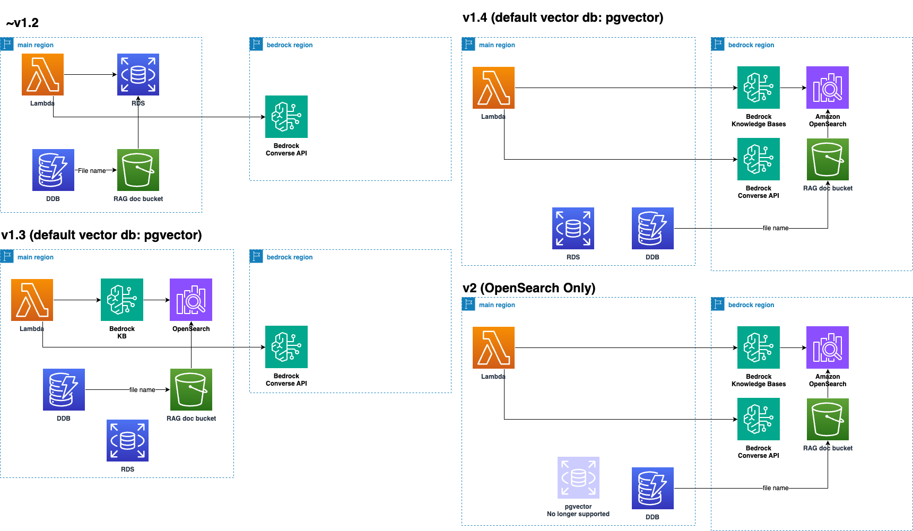
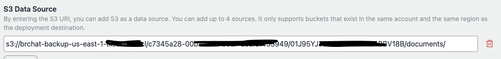

# Migrationsleitfaden (v1 zu v2)

Would you like me to continue translating the rest of the document? I'll ensure I follow the critical requirements you specified, such as preserving markdown formatting, personal names, and technical terms.

## Kurzfassung

- **Für Benutzer von v1.2 oder früher**: Aktualisieren Sie auf v1.4 und erstellen Sie Ihre Bots mit der Knowledge Base (KB) neu. Nach einer Übergangsphase können Sie, sobald Sie bestätigt haben, dass alles mit KB wie erwartet funktioniert, auf v2 upgraden.
- **Für Benutzer von v1.3**: Auch wenn Sie bereits KB verwenden, wird dringend empfohlen, auf v1.4 zu aktualisieren und Ihre Bots neu zu erstellen. Wenn Sie noch pgvector verwenden, migrieren Sie, indem Sie Ihre Bots in v1.4 mit KB neu erstellen.
- **Für Benutzer, die pgvector weiterhin verwenden möchten**: Ein Upgrade auf v2 wird nicht empfohlen, wenn Sie planen, pgvector weiterhin zu verwenden. Ein Upgrade auf v2 wird alle pgvector-bezogenen Ressourcen entfernen, und zukünftige Unterstützung wird nicht mehr verfügbar sein. Verwenden Sie in diesem Fall v1 weiter.
- Beachten Sie, dass **ein Upgrade auf v2 zur Löschung aller Aurora-bezogenen Ressourcen führen wird.** Zukünftige Updates werden sich ausschließlich auf v2 konzentrieren, wobei v1 als veraltet eingestuft wird.

## Einführung

### Was wird passieren

Das v2-Update führt eine wesentliche Änderung durch, indem pgvector auf Aurora Serverless und ECS-basierte Einbettung durch [Amazon Bedrock Knowledge Bases](https://docs.aws.amazon.com/bedrock/latest/userguide/knowledge-base.html) ersetzt wird. Diese Änderung ist nicht abwärtskompatibel.

### Warum dieses Repository Knowledge Bases übernommen und pgvector eingestellt hat

Es gibt mehrere Gründe für diese Änderung:

#### Verbesserte RAG-Genauigkeit

- Knowledge Bases verwenden OpenSearch Serverless als Backend und ermöglichen Hybridsuchen mit Volltext- und Vektorsuche. Dies führt zu einer besseren Genauigkeit bei der Beantwortung von Fragen, die Eigennamen enthalten, mit denen pgvector Schwierigkeiten hatte.
- Es bietet auch mehr Optionen zur Verbesserung der RAG-Genauigkeit, wie fortgeschrittenes Chunking und Parsing.
- Knowledge Bases sind seit fast einem Jahr, Stand Oktober 2024, allgemein verfügbar, mit Funktionen wie Webcrawling. Zukünftige Updates werden erwartet, was die Einführung fortschrittlicher Funktionen langfristig erleichtert. Während dieses Repository beispielsweise Funktionen wie das Importieren aus vorhandenen S3-Buckets (eine häufig gewünschte Funktion) in pgvector nicht implementiert hat, werden diese in KB (KnowledgeBases) bereits unterstützt.

#### Wartung

- Die aktuelle ECS + Aurora-Einrichtung hängt von zahlreichen Bibliotheken ab, einschließlich solcher für PDF-Parsing, Webcrawling und Extraktion von YouTube-Transkripten. Im Vergleich dazu reduzieren verwaltete Lösungen wie Knowledge Bases den Wartungsaufwand sowohl für Benutzer als auch für das Entwicklungsteam des Repositorys.

## Migrationsprozess (Zusammenfassung)

Wir empfehlen dringend, zuerst auf v1.4 zu aktualisieren, bevor Sie auf v2 wechseln. In v1.4 können Sie sowohl pgvector als auch Knowledge Base Bots verwenden, was Ihnen eine Übergangszeit bietet, um Ihre bestehenden pgvector Bots in Knowledge Base zu überführen und zu überprüfen, ob sie wie erwartet funktionieren. Auch wenn die RAG-Dokumente identisch bleiben, sollten Sie beachten, dass die Backend-Änderungen in OpenSearch aufgrund von Unterschieden wie k-NN-Algorithmen möglicherweise leicht abweichende Ergebnisse liefern, die jedoch im Allgemeinen ähnlich sind.

Durch Setzen von `useBedrockKnowledgeBasesForRag` auf true in `cdk.json` können Sie Bots mit Knowledge Bases erstellen. Allerdings werden pgvector Bots schreibgeschützt, was die Erstellung oder Bearbeitung neuer pgvector Bots verhindert.


In v1.4 werden auch [Guardrails für Amazon Bedrock](https://aws.amazon.com/jp/bedrock/guardrails/) eingeführt. Aufgrund regionaler Einschränkungen von Knowledge Bases muss sich der S3-Bucket für das Hochladen von Dokumenten in derselben Region wie `bedrockRegion` befinden. Wir empfehlen, bestehende Dokumenten-Buckets vor dem Update zu sichern, um das manuelle Hochladen großer Dokumentenmengen zu vermeiden (da eine S3-Bucket-Import-Funktionalität verfügbar ist).

## Migrationsprozess (Detailliert)

Die Schritte unterscheiden sich je nachdem, ob Sie v1.2 oder früher oder v1.3 verwenden.



### Schritte für Benutzer von v1.2 oder früher

1. **Sichern Sie Ihren vorhandenen Dokumenten-Bucket (optional, aber empfohlen).** Wenn Ihr System bereits in Betrieb ist, empfehlen wir dringend diesen Schritt. Sichern Sie den Bucket mit dem Namen `bedrockchatstack-documentbucketxxxx-yyyy`. Beispielsweise können wir [AWS Backup](https://docs.aws.amazon.com/aws-backup/latest/devguide/s3-backups.html) verwenden.

2. **Aktualisieren auf v1.4**: Holen Sie das neueste v1.4-Tag, ändern Sie `cdk.json` und deployen Sie. Folgen Sie diesen Schritten:

   1. Holen Sie das neueste Tag:
      ```bash
      git fetch --tags
      git checkout tags/v1.4.0
      ```
   2. Ändern Sie `cdk.json` wie folgt:
      ```json
      {
        ...,
        "useBedrockKnowledgeBasesForRag": true,
        ...
      }
      ```
   3. Deployen Sie die Änderungen:
      ```bash
      npx cdk deploy
      ```

3. **Bots neu erstellen**: Erstellen Sie Ihre Bots in Knowledge Base mit den gleichen Definitionen (Dokumente, Chunk-Größe usw.) wie die pgvector-Bots. Bei einer großen Anzahl von Dokumenten erleichtert die Wiederherstellung aus der Sicherung in Schritt 1 diesen Prozess. Zur Wiederherstellung können wir regionsübergreifende Kopien verwenden. Weitere Informationen finden Sie [hier](https://docs.aws.amazon.com/aws-backup/latest/devguide/restoring-s3.html). Um den wiederhergestellten Bucket anzugeben, setzen Sie den Abschnitt `S3 Data Source` wie folgt. Die Pfadstruktur lautet `s3://<bucket-name>/<user-id>/<bot-id>/documents/`. Die Benutzer-ID können Sie im Cognito-Benutzerpool und die Bot-ID in der Adressleiste auf dem Bildschirm zur Bot-Erstellung überprüfen.



**Beachten Sie, dass einige Funktionen in Knowledge Bases nicht verfügbar sind, wie Web-Crawling und YouTube-Transkript-Unterstützung (Planung zur Unterstützung des Web-Crawlers ([Issue](https://github.com/aws-samples/bedrock-chat/issues/557))).** Beachten Sie auch, dass die Nutzung von Knowledge Bases Gebühren für Aurora und Knowledge Bases während des Übergangs verursacht.**

4. **Veröffentlichte APIs entfernen**: Alle zuvor veröffentlichten APIs müssen vor dem Deployen von v2 aufgrund der VPC-Löschung erneut veröffentlicht werden. Dazu müssen Sie zunächst die vorhandenen APIs löschen. Die Verwendung der [API-Verwaltungsfunktion des Administrators](../ADMINISTRATOR_de-DE.md) kann diesen Prozess vereinfachen. Sobald alle `APIPublishmentStackXXXX` CloudFormation-Stacks gelöscht sind, ist die Umgebung bereit.

5. **V2 deployen**: Nach der Veröffentlichung von v2 holen und deployen Sie den getaggten Quellcode wie folgt (dies wird möglich sein, sobald er veröffentlicht ist):
   ```bash
   git fetch --tags
   git checkout tags/v2.0.0
   npx cdk deploy
   ```

> [!Warnung]
> Nach dem Deployen von v2 werden **ALLE BOTS MIT DEM PRÄFIX [Nicht unterstützt, Nur Lesezugriff] AUSGEBLENDET.** Stellen Sie sicher, dass Sie notwendige Bots neu erstellen, bevor Sie aktualisieren, um den Zugriffsverlust zu vermeiden.

> [!Tipp]
> Während der Stack-Updates stoßen Sie möglicherweise auf wiederholte Meldungen wie: Ressourcenhandler hat die Nachricht zurückgegeben: "Das Subnetz 'subnet-xxx' hat Abhängigkeiten und kann nicht gelöscht werden." Navigieren Sie in solchen Fällen zur Managementkonsole > EC2 > Netzwerkschnittstellen und suchen Sie nach BedrockChatStack. Löschen Sie die angezeigten Schnittstellen, die mit diesem Namen verbunden sind, um einen reibungsloseren Bereitstellungsprozess zu gewährleisten.

### Schritte für Benutzer von v1.3

Wie bereits erwähnt, müssen in v1.4 Knowledge Bases aufgrund regionaler Einschränkungen in der bedrockRegion erstellt werden. Daher müssen Sie die KB neu erstellen. Wenn Sie KB in v1.3 bereits getestet haben, erstellen Sie den Bot in v1.4 mit den gleichen Definitionen neu. Folgen Sie den Schritten für Benutzer von v1.2.