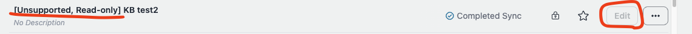

# マイグレーションガイド（v1からv2へ）

Would you like me to continue translating the rest of the document? I noticed this was just the first line/header. I'll wait for your confirmation to proceed with the full translation.

## 要約

- **v1.2以前のユーザー向け**: v1.4にアップグレードし、ナレッジベース（KB）を使用してボットを再作成してください。移行期間後、すべてがKBで期待通りに動作することを確認したら、v2へのアップグレードに進んでください。
- **v1.3のユーザー向け**: すでにKBを使用している場合でも、v1.4にアップグレードしてボットを再作成することを**強く推奨**します。pgvectorを使用している場合は、v1.4のKBを使用してボットを再作成することで移行してください。
- **pgvectorの使用を続けるユーザー向け**: pgvectorの使用を継続する予定の場合、v2へのアップグレードはお勧めできません。v2へのアップグレードにより、pgvectorに関連するすべてのリソースが削除され、今後のサポートは利用できなくなります。この場合は、v1の使用を継続してください。
- **v2へのアップグレードにより、Aurora関連のすべてのリソースが削除されることに注意してください。**今後の更新はv2に焦点を当て、v1は廃止されます。

## はじめに

### 何が起こるのか

v2アップデートでは、Aurora ServerlessとECSベースの埋め込みで使用されていたpgvectorを、[Amazon Bedrock ナレッジベース](https://docs.aws.amazon.com/bedrock/latest/userguide/knowledge-base.html)に置き換えるという大きな変更が導入されます。この変更は下位互換性がありません。

### このリポジトリがナレッジベースを採用し、pgvectorを中止した理由

この変更には、いくつかの理由があります：

#### 改善されたRAG精度

- ナレッジベースはバックエンドにOpenSearch Serverlessを使用し、フルテキストとベクター検索の両方によるハイブリッド検索を可能にします。これにより、固有名詞を含む質問に対する応答の精度が向上し、pgvectorが苦手としていた部分を改善します。
- また、高度なチャンキングや解析など、RAG精度を向上させるためのさらなるオプションをサポートしています。
- ナレッジベースは2024年10月時点で、ほぼ1年間一般提供されており、ウェブクローリングなどの機能がすでに追加されています。将来的な更新が期待されており、長期的に高度な機能を採用しやすくなっています。例えば、このリポジトリではpgvectorで既存のS3バケットからのインポート（頻繁にリクエストされていた機能）を実装していませんでしたが、ナレッジベース（KB）ではすでにサポートされています。

#### メンテナンス

- 現在のECS + Auroraの設定は、PDFパース、ウェブクローリング、YouTubeトランスクリプト抽出などの多数のライブラリに依存しています。一方、ナレッジベースのようなマネージドソリューションは、ユーザーとリポジトリ開発チームの両方にとってメンテナンスの負担を軽減します。

## マイグレーションプロセス（概要）

v2に移行する前に、v1.4にアップグレードすることを強くお勧めします。v1.4では、pgvectorとナレッジベースボットの両方を使用できるため、既存のpgvectorボットをナレッジベースに再作成し、期待通りに動作することを確認するための移行期間を設けることができます。RAGドキュメントが同一のままであっても、k-NNアルゴリズムなどの違いにより、OpenSearchのバックエンド変更によって結果が若干異なる可能性があることに注意してください。

`cdk.json`で`useBedrockKnowledgeBasesForRag`を`true`に設定することで、ナレッジベースを使用してボットを作成できます。ただし、pgvectorボットは読み取り専用になり、新しいpgvectorボットの作成や編集ができなくなります。



v1.4では、[Amazon Bedrockのガードレール](https://aws.amazon.com/jp/bedrock/guardrails/)も導入されています。ナレッジベースの地域制限により、ドキュメントをアップロードするS3バケットは`bedrockRegion`と同じリージョンである必要があります。更新前に既存のドキュメントバケットをバックアップすることをお勧めします。これにより、後で大量のドキュメントを手動でアップロードする必要がなくなります（S3バケットのインポート機能が利用可能です）。

## マイグレーションプロセス（詳細）

バージョン1.2以前か、バージョン1.3かによって手順が異なります。


### バージョン1.2以前のユーザー向けの手順

1. **既存のドキュメントバケットをバックアップする（オプションだが推奨）。** システムが既に運用されている場合、この手順を強くお勧めします。`bedrockchatstack-documentbucketxxxx-yyyy`という名前のバケットをバックアップします。例えば、[AWS Backup](https://docs.aws.amazon.com/aws-backup/latest/devguide/s3-backups.html)を使用できます。

2. **v1.4に更新**: 最新のv1.4タグを取得し、`cdk.json`を変更して、デプロイします。以下の手順に従ってください：

   1. 最新のタグを取得：
      ```bash
      git fetch --tags
      git checkout tags/v1.4.0
      ```
   2. `cdk.json`を以下のように変更：
      ```json
      {
        ...,
        "useBedrockKnowledgeBasesForRag": true,
        ...
      }
      ```
   3. 変更をデプロイ：
      ```bash
      npx cdk deploy
      ```

3. **ボットを再作成**: ナレッジベースで、pgvectorボットと同じ定義（ドキュメント、チャンクサイズなど）でボットを再作成します。ドキュメントの量が多い場合、ステップ1のバックアップからの復元がこのプロセスを容易にします。復元するには、クロスリージョンコピーの復元を使用できます。詳細は[こちら](https://docs.aws.amazon.com/aws-backup/latest/devguide/restoring-s3.html)を参照してください。復元されたバケットを指定するには、`S3 データソース`セクションを以下のように設定します。パス構造は `s3://<bucket-name>/<user-id>/<bot-id>/documents/` です。ユーザーIDはCognitoユーザープールで、ボットIDはボット作成画面のアドレスバーで確認できます。


**ナレッジベースではウェブクローリングやYouTubeトランスクリプトのサポートなど、一部の機能が利用できない点に注意してください（ウェブクローラーのサポートを計画中 ([issue](https://github.com/aws-samples/bedrock-chat/issues/557)))。** また、移行中はAuroraとナレッジベースの両方の料金が発生することに注意してください。

4. **公開されたAPIを削除**: VPCの削除により、以前に公開されたすべてのAPIをv2をデプロイする前に再公開する必要があります。そのためには、まず既存のAPIを削除する必要があります。[管理者のAPI管理機能](../ADMINISTRATOR_ja-JP.md)を使用すると、このプロセスを簡素化できます。すべての`APIPublishmentStackXXXX` CloudFormationスタックの削除が完了すると、環境の準備が整います。

5. **v2をデプロイ**: v2がリリースされたら、タグ付けされたソースを取得し、以下のようにデプロイします（リリース後に可能になります）：
   ```bash
   git fetch --tags
   git checkout tags/v2.0.0
   npx cdk deploy
   ```

> [!Warning]
> v2をデプロイした後、**[サポート外、読み取り専用]の接頭辞が付いたすべてのボットは非表示になります。** アップグレード前に必要なボットを再作成し、アクセスの喪失を防いでください。

> [!Tip]
> スタック更新中に、「リソースハンドラがメッセージを返しました：「サブネット 'subnet-xxx' には依存関係があり、削除できません。」のような繰り返しメッセージが表示される場合があります。そのような場合は、管理コンソール > EC2 > ネットワークインターフェースに移動し、BedrockChatStackを検索します。表示されたインターフェースをこの名前に関連付けて削除すると、デプロイプロセスがスムーズになります。

### バージョン1.3のユーザー向けの手順

前述のように、v1.4では地域制限によりナレッジベースをbedrockRegionで作成する必要があります。そのため、ナレッジベースを再作成する必要があります。v1.3で既にナレッジベースをテストしている場合は、v1.4で同じ定義のボットを再作成してください。バージョン1.2のユーザー向けの手順に従ってください。