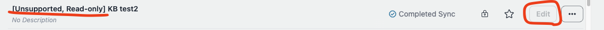
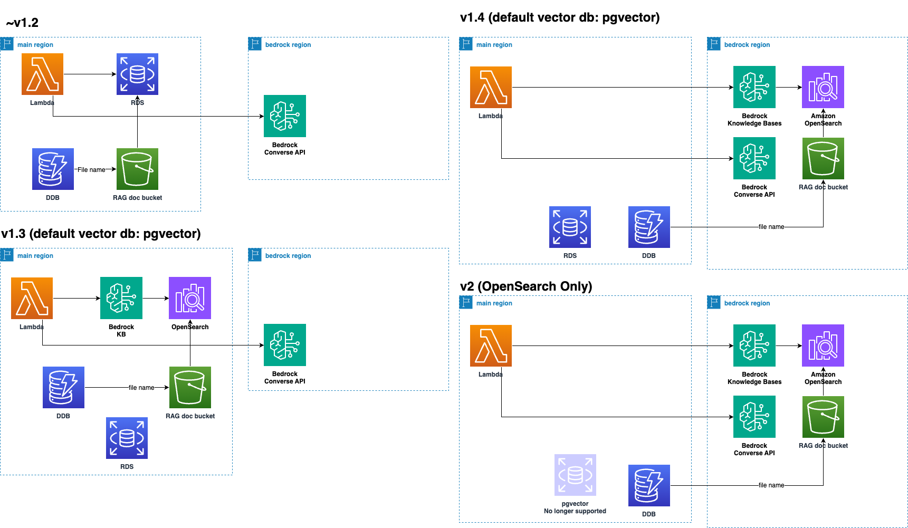
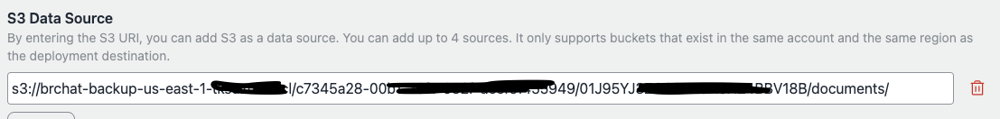

# 迁移指南（v1 到 v2）

## 总结

- **对于 v1.2 或更早版本的用户**：升级到 v1.4 并使用知识库（KB）重新创建您的机器人。在过渡期间，确认一切正常后，再升级到 v2。
- **对于 v1.3 的用户**：即使您已经在使用 KB，也**强烈建议**升级到 v1.4 并重新创建您的机器人。如果您仍在使用 pgvector，请通过在 v1.4 中使用 KB 重新创建机器人来迁移。
- **对于希望继续使用 pgvector 的用户**：如果您计划继续使用 pgvector，则不建议升级到 v2。升级到 v2 将删除所有与 pgvector 相关的资源，并且将不再提供未来支持。在这种情况下，请继续使用 v1。
- 请注意，**升级到 v2 将导致删除所有 Aurora 相关资源。**未来的更新将专注于 v2，v1 将被弃用。

## 介绍

### 将会发生什么

v2 更新通过将 Aurora Serverless 和基于 ECS 的嵌入替换为 [Amazon Bedrock 知识库](https://docs.aws.amazon.com/bedrock/latest/userguide/knowledge-base.html)引入了重大变更。这一变更不向后兼容。

### 为什么本仓库采用了知识库并停止使用 pgvector

这一变更有几个原因：

#### 改进的 RAG 准确性

- 知识库使用 OpenSearch Serverless 作为后端，允许进行全文和向量搜索的混合搜索。这提高了对包含专有名词的问题的响应准确性，而 pgvector 在这方面存在困难。
- 它还支持更多改进 RAG 准确性的选项，如高级分块和解析。
- 截至 2024 年 10 月，知识库已经正式可用近一年，并且已添加了网页爬取等功能。预期未来会有更新，从长远来看更容易采用高级功能。例如，虽然本仓库在 pgvector 中尚未实现从现有 S3 存储桶导入（这是一个频繁被请求的功能），但知识库（KB）已经支持此功能。

#### 维护

- 当前的 ECS + Aurora 设置依赖于众多库，包括用于 PDF 解析、网页爬取和提取 YouTube 字幕的库。相比之下，像知识库这样的托管解决方案可以减轻用户和仓库开发团队的维护负担。

## 迁移过程（摘要）

我们强烈建议在迁移到 v2 之前先升级到 v1.4。在 v1.4 中，您可以同时使用 pgvector 和知识库机器人，这提供了一个过渡期，让您可以在知识库中重新创建现有的 pgvector 机器人并验证它们是否按预期工作。即使 RAG 文档保持完全相同，请注意由于 OpenSearch 的后端变更（如 k-NN 算法的差异），可能会产生略微不同但通常相似的结果。

通过在 `cdk.json` 中将 `useBedrockKnowledgeBasesForRag` 设置为 true，您可以创建使用知识库的机器人。但是，pgvector 机器人将变为只读状态，禁止创建或编辑新的 pgvector 机器人。



在 v1.4 中，还引入了 [Amazon Bedrock 的防护栏](https://aws.amazon.com/jp/bedrock/guardrails/)。由于知识库的区域限制，上传文档的 S3 存储桶必须与 `bedrockRegion` 位于同一区域。我们建议在更新前备份现有文档存储桶，以避免后续需要手动上传大量文档（因为 S3 存储桶导入功能已可用）。

## 迁移过程（详细说明）

根据您是使用 v1.2 或更早版本，还是 v1.3，步骤会有所不同。



### 针对 v1.2 或更早版本的用户

1. **备份现有文档存储桶（可选但推荐）。** 如果您的系统已经在运行，我们强烈建议执行此步骤。备份名为 `BedrockAIAssistantstack-documentbucketxxxx-yyyy` 的存储桶。例如，我们可以使用 [AWS 备份](https://docs.aws.amazon.com/aws-backup/latest/devguide/s3-backups.html)。

2. **更新到 v1.4**：获取最新的 v1.4 标签，修改 `cdk.json`，并部署。按照以下步骤操作：

   1. 获取最新标签：
      ```bash
      git fetch --tags
      git checkout tags/v1.4.0
      ```
   2. 按如下方式修改 `cdk.json`：
      ```json
      {
        ...,
        "useBedrockKnowledgeBasesForRag": true,
        ...
      }
      ```
   3. 部署更改：
      ```bash
      npx cdk deploy
      ```

3. **重新创建您的机器人**：在知识库上重新创建您的机器人，使用与 pgvector 机器人相同的定义（文档、块大小等）。如果您有大量文档，则可以通过步骤 1 中的备份还原来简化此过程。要还原，我们可以使用跨区域副本还原。更多详情请访问[此处](https://docs.aws.amazon.com/aws-backup/latest/devguide/restoring-s3.html)。要指定还原的存储桶，请按如下方式设置 `S3 数据源` 部分。路径结构为 `s3://<bucket-name>/<user-id>/<bot-id>/documents/`。您可以在 Cognito 用户池上查看用户 ID，并在机器人创建屏幕的地址栏上查看机器人 ID。



**请注意，知识库不支持某些功能，如网页爬取和 YouTube 字幕支持（计划支持网页爬虫（[问题](https://github.com/aws-samples/bedrock-chat/issues/557)））。** 另外，请记住，在过渡期间，使用知识库将同时产生 Aurora 和知识库的费用。

4. **删除已发布的 API**：由于 VPC 删除，所有先前发布的 API 需要在部署 v2 之前重新发布。为此，您需要先删除现有的 API。使用[管理员的 API 管理功能](../ADMINISTRATOR_zh-CN.md)可以简化此过程。一旦所有 `APIPublishmentStackXXXX` CloudFormation 堆栈删除完成，环境将准备就绪。

5. **部署 v2**：在 v2 发布后，获取标签源并按如下方式部署（这将在发布后可用）：
   ```bash
   git fetch --tags
   git checkout tags/v2.0.0
   npx cdk deploy
   ```

> [!警告]
> 部署 v2 后，**所有带有前缀 [不支持，只读] 的机器人将被隐藏。** 请确保在升级前重新创建必要的机器人，以避免丢失访问权限。

> [!提示]
> 在堆栈更新期间，您可能会遇到重复的消息，如："资源处理程序返回消息：'子网 'subnet-xxx' 有依赖项，无法删除。'"在这种情况下，请导航到管理控制台 > EC2 > 网络接口，并搜索 BedrockAIAssistantStack。删除与此名称关联的显示接口，以帮助确保更顺利的部署过程。

### 针对 v1.3 用户的步骤

如前所述，在 v1.4 中，由于区域限制，知识库必须在 bedrockRegion 中创建。因此，您需要重新创建知识库。如果您已在 v1.3 中测试过知识库，请在 v1.4 中使用相同的定义重新创建机器人。按照针对 v1.2 用户概述的步骤进行操作。